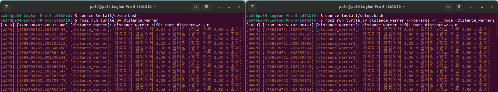
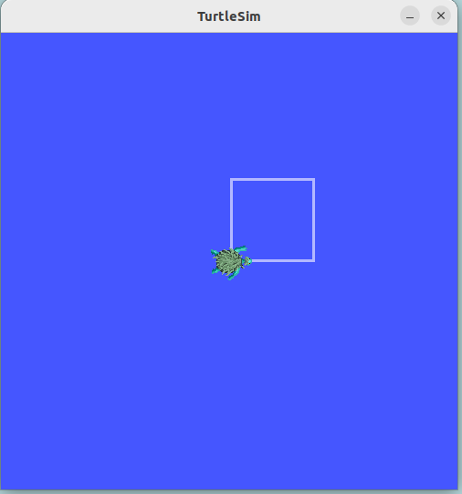
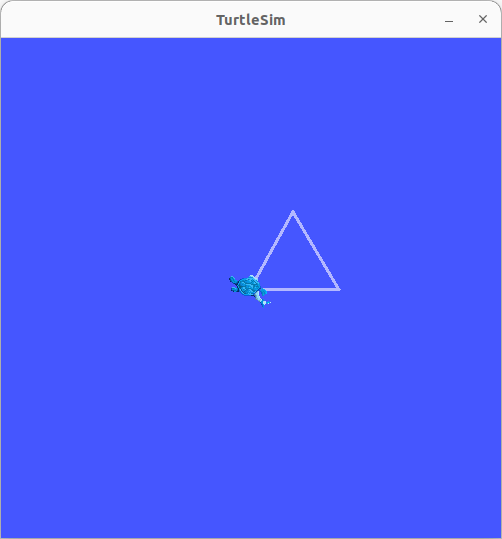
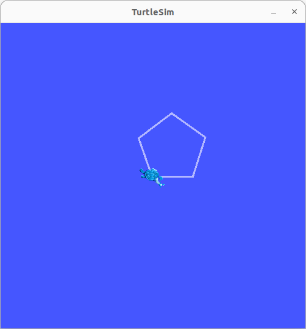
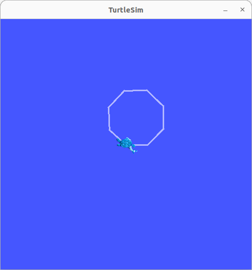
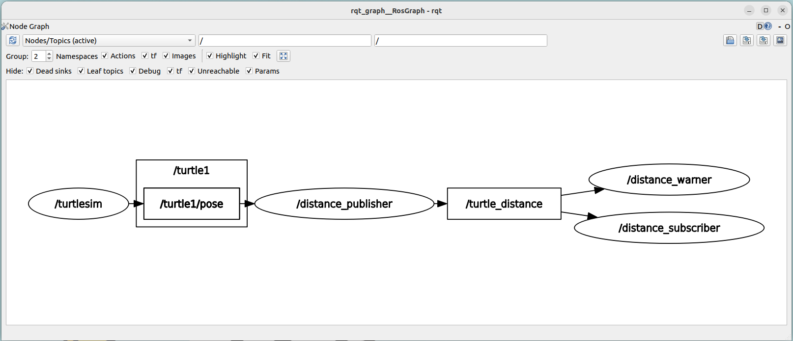
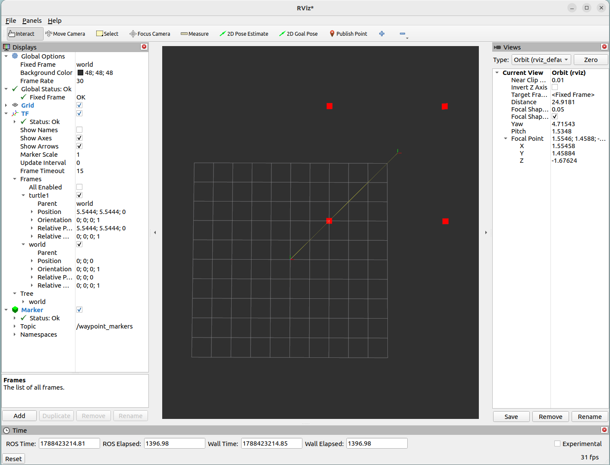
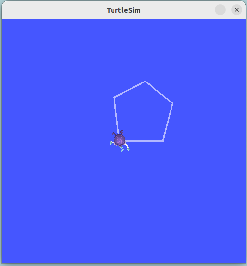

# 모듈 2 과제 - turtlesim_ROS2패키지

## 문제 1. C++ 빌드 체계 (g++ 다중 파일 빌드와 CMake 전환)

### 1-1. 수동 2단계 빌드 명령

**stop_distance.cpp**
- 빌드: `g++ -Wall -std=c++17 stop_distance.cpp -o stop_distance`
- 실행: `./stop_distance 10 0.7`
```bash
pa34@pa34-Legion-Pro-5-16IAX10:~/Desktop/physical_ai/projects/assignment/assign_lv1/lv1_module2/cpp_basics$ g++ -Wall -std=c++17 stop_distance.cpp -o stop_distance

pa34@pa34-Legion-Pro-5-16IAX10:~/Desktop/physical_ai/projects/assignment/assign_lv1/lv1_module2/cpp_basics$ ./stop_distance 10 0.7
Speed: 10 m/s, Friction coefficient: 0.7
Stopping distance: 7.2812 m
```

**Motor 클래스 세팅 및 파일 분리**
`motor.hpp`
- 변수: 이름(`name_`), 현재 속도(`speed_`), 속도 상한(`max_speed_`), 구동 상태(`running_`)
- 함수 body 부분 없이 시그니처만 선언
	- `Start`/`Stop`: 구동 시작/정지, `SetMaxSpeed`: 속도 상한 설정, `SetSpeed`: 목표 속도 설정, `GetSpeed`/`IsRunning`: 조회, `PrintStatus`: 상태 출력

`motor.cpp`
- 함수들의 실제 동작을 정의
- `Start`/`Stop`: `running_` 플래그를 토글 (`Stop()`은 추가로 `speed_`를 0으로 리셋)
- `SetSpeed`: `running_`이 `false`면 요청을 무시(경고 로그만 남김), `true`면 clamp로 값을 `[0, max_speed_]`범위로 잘라 저장
- `PrintStatus`: 이름, 구동 상태, 현재 속도, 상한을 한 줄로 출력

`main.cpp`
1) `Motor wheel_motor("wheel_motor");` 로 객체 생성
2) `Start` 호출 전에 `SetSpeed(120)` 을 호출해 요청이 무시되는지 확인
3) `SetMaxSpeed(200)` → `Start()` → `SetSpeed(120)` 순서로 정상 반영되는지 확인
4) 상한을 넘는 `SetSpeed(300)` 을 호출해 200으로 clamp 되는지 확인
5) `Stop` 호출 후 속도가 0으로 리셋되는지 확인
→ 각 단계마다 `PrintStatus`로 상태를 출력해 결과 확인


**수동 2단계 빌드 명령**
1) `motor.cpp`,`main.cpp` 컴파일
```bash
g++ -Wall -std=c++17 -c motor.cpp -o motor.o
g++ -Wall -std=c++17 -c main.cpp -o main.o
```

2) 링크 연결 후 출력
	- object 파일들을 하나의 실행파일로 만듦
```bash
g++ motor.o main.o -o motor_app
./motor_app
```

- 실행 결과
```bash
pa34@pa34-Legion-Pro-5-16IAX10:~/Desktop/physical_ai/projects/assignment/assign_lv1/lv1_module2/cpp_basics$ ./motor_app
[wheel_motor] Stop() 상태라 속도 설정을 무시함
[wheel_motor] running=false, speed=0 rpm (max=1000)
[wheel_motor] running=true, speed=120 rpm (max=200)
[wheel_motor] running=true, speed=200 rpm (max=200)
[wheel_motor] running=false, speed=0 rpm (max=200)
```


---

### 1-2. `undefined reference` 재현

- `motor.o`를 빼고 `main.o`만으로 build하면 링커가 `main.o`에서 호출되는 함수의 본체가 어디있는지 모름 → `undefined reference` 발생
```bash
pa34@pa34-Legion-Pro-5-16IAX10:~/Desktop/physical_ai/projects/assignment/assign_lv1/lv1_module2/cpp_basics$ g++ main.o -o motor_app_broken
/usr/bin/ld: main.o: in function `main':
main.cpp:(.text+0x51): undefined reference to `Motor::Motor(std::__cxx11::basic_string<char, std::char_traits<char>, std::allocator<char> >)'
/usr/bin/ld: main.cpp:(.text+0x81): undefined reference to `Motor::SetSpeed(double)'
/usr/bin/ld: main.cpp:(.text+0x8d): undefined reference to `Motor::PrintStatus() const'
/usr/bin/ld: main.cpp:(.text+0xa5): undefined reference to `Motor::SetMaxSpeed(double)'
/usr/bin/ld: main.cpp:(.text+0xb1): undefined reference to `Motor::Start()'
/usr/bin/ld: main.cpp:(.text+0xc9): undefined reference to `Motor::SetSpeed(double)'
/usr/bin/ld: main.cpp:(.text+0xd5): undefined reference to `Motor::PrintStatus() const'
/usr/bin/ld: main.cpp:(.text+0xed): undefined reference to `Motor::SetSpeed(double)'
/usr/bin/ld: main.cpp:(.text+0xf9): undefined reference to `Motor::PrintStatus() const'
/usr/bin/ld: main.cpp:(.text+0x105): undefined reference to `Motor::Stop()'
/usr/bin/ld: main.cpp:(.text+0x111): undefined reference to `Motor::PrintStatus() const'
collect2: error: ld returned 1 exit status
```

> **컴파일 에러와의 차이**
> 1) 컴파일 에러: `.cpp` 파일 내에 문법/타입이 틀렸을 때 발생 - `-c` 단계에서 발생하고 `.o` 파일 자체가 안만들어짐
> 2) `undefined reference`: 링크 에러 중 하나. 각 `.cpp`는 개별적으로 문법이 다 맞아 `.o`까지는 잘 만들어짐. 하지만 링크 시, 호출되는 함수의 실제 구현 파트(본체)가 담긴 `.o`가 빠져서 링커가 못찾을 때 발생


---

### 1-3. CMake 빌드 출력

- CMake 전환: Motor 프로젝트 이용 (`motor.hpp`/`motor.cpp`/`main.cpp`) → `CMakeLists.txt` 만듦

**CMake 빌드**

- 실행 결과
	- 참고: CMake로 빌드할 때, CMake는 자기만의 명명 규칙을 씀 - 원본 소스 파일 이름(`motor.cpp`)을 그대로 두고 뒤에 `.o`만 붙여서 `motor.cpp.o`라고 만듦
```bash
pa34@pa34-Legion-Pro-5-16IAX10:~/Desktop/physical_ai/projects/assignment/assign_lv1/lv1_module2/cpp_basics$ mkdir -p build && cd build

pa34@pa34-Legion-Pro-5-16IAX10:~/Desktop/physical_ai/projects/assignment/assign_lv1/lv1_module2/cpp_basics/build$ cmake ..
-- The CXX compiler identification is GNU 11.4.0
-- Detecting CXX compiler ABI info
-- Detecting CXX compiler ABI info - done
-- Check for working CXX compiler: /usr/bin/c++ - skipped
-- Detecting CXX compile features
-- Detecting CXX compile features - done
-- Configuring done
-- Generating done
-- Build files have been written to: /home/pa34/Desktop/physical_ai/projects/assignment/assign_lv1/lv1_module2/cpp_basics/build

pa34@pa34-Legion-Pro-5-16IAX10:~/Desktop/physical_ai/projects/assignment/assign_lv1/lv1_module2/cpp_basics/build$ make
[ 33%] Building CXX object CMakeFiles/motor_app.dir/main.cpp.o
[ 66%] Building CXX object CMakeFiles/motor_app.dir/motor.cpp.o
[100%] Linking CXX executable motor_app
[100%] Built target motor_app

pa34@pa34-Legion-Pro-5-16IAX10:~/Desktop/physical_ai/projects/assignment/assign_lv1/lv1_module2/cpp_basics/build$ ./motor_app
[wheel_motor] Stop() 상태라 속도 설정을 무시함
[wheel_motor] running=false, speed=0 rpm (max=1000)
[wheel_motor] running=true, speed=120 rpm (max=200)
[wheel_motor] running=true, speed=200 rpm (max=200)
[wheel_motor] running=false, speed=0 rpm (max=200)
```


**증분 빌드**
- 소스코드가 바뀔 때 마다 프로젝트 전체를 처음부터 다시 컴파일하는게 아니라, <u>마지막 빌드 이후 실제로 바뀐 파일(+ 그 파일에 의존하는 파일들)만 다시 컴파일하고, 안 바뀐 나머지는 예전에 만들어 둔 `.o` 결과물을 재사용하는 빌드 방식</u>

- 수정 파일: `motor.cpp` (`SetSpeed` 로그 메세지)
	- 기존: `std::cout << "[" << name_ << "] Stop() 상태라 속도 설정을 무시함\n";`
	- 변경 후: `std::cout << "[" << name_ << "] not running — ignoring SetSpeed(" << rpm << ")\n";`

- 실행 결과
	- 재컴파일된 파일: `motor.cpp.o`만 재컴파일됨을 터미널 출력을 통해 확인할 수 있음 (`main.cpp.o`는 그대로 재사용)
```bash
pa34@pa34-Legion-Pro-5-16IAX10:~/Desktop/physical_ai/projects/assignment/assign_lv1/lv1_module2/cpp_basics/build$ make
Consolidate compiler generated dependencies of target motor_app
[ 33%] Building CXX object CMakeFiles/motor_app.dir/motor.cpp.o
[ 66%] Linking CXX executable motor_app
[100%] Built target motor_app
```

> **판단 근거**
> • `make`: 각 소스 파일의 수정 시각(mtime)을 대응하는 `.o` 파일의 mtime과 비교해, 소스가 더 최신이면 그 파일만 재컴파일함
> • 실제로 처음 빌드 출력에는 있었던 `main.cpp.o`가 증분 빌드 출력에는 나타나지 않았는데, 이는 이전에 만들어둔 `main.cpp.o`를 그대로 재사용했다는 뜻
> • CMake가 생성한 Makefile은 파일 단위 의존성 그래프를 갖고 있어, 변경된 소스만 다시 컴파일함
> • 다만 오브젝트 파일 중 하나라도 바뀌면 최종 실행파일을 다시 만들어야 하므로 링크 단계(`Linking CXX executable motor_app`)는 매번 재수행됨


---

## 문제 2. 현대 C++로 센서 계층 구현 (RAII·다형성·STL)

**디렉토리 구조**
```text
cpp_basics/sensors/
├── sensor.hpp          — 추상 클래스 Sensor
├── lidar.hpp / lidar.cpp  — Lidar (Sensor 상속)
├── imu.hpp / imu.cpp      — Imu (Sensor 상속)
├── sensors_demo.cpp    — 다형성 루프 등 4가지 데모 실행 파일
├── clamp.cpp           — 함수 템플릿 단독 데모
└── leak_demo.cpp        — 메모리 누수 재현/검출 데모
```


---

### 2-1. 다형성 루프 출력

**다형성 루프를 이루는 파일**
- `sensor.hpp`
	- `Sensor` 추상 클래스 생성, 생성자에서 이름(name_)을 받아 저장
	- `virtual double read() = 0;` - 순수 가상 함수로 선언
	- `virtual ~Sensor()` - 가상 소멸자 (`Sensor*` 로 파생 객체를 다룰 때도 올바른 소멸자가 불리도록 함)
	- `name()` getter (읽기 전용 접근), `name_`은 `protected`(외부 코드는 접근 제한, 파생 클래스에서는 접근 가능하게)

- `lidar.hpp` / `lidar.cpp`
	- `Sensor`를 `public` 상속
	- 생성자에서 `Sensor("lidar")`로 이름 지정, `tick_` 카운터로 호출 횟수 추적
	- `read() override` — 호출할 때마다 `0.05 * tick_`을 반환 (값이 점점 증가)

- `imu.hpp` / `imu.cpp`
	- `lidar`와 동일한 패턴, 이름만 `"imu"`
	- `read() override` — `0.01 * tick_` 반환

- `sensors_demo.cpp`의 `PolymorphicReadLoop()` (다형성 루프)
	- `std::vector<std::unique_ptr<Sensor>>`에 `Lidar`, `Imu` 객체를 하나씩 담아 다형성 루프로 읽음
	- 함수가 끝나 `vector`가 스코프를 벗어나면 각 `unique_ptr`이 소멸하면서 `delete` 수행 → 가상 소멸자 덕분에 `~Lidar()`/`~Imu()`까지 정상 호출됨
		- virtual 이 있으면:  "~Lidar()" 다음 "~Sensor(lidar)" 둘 다 출력됨
		- sensor.hpp 의 virtual 을 지우고 다시 빌드하면: "~Sensor(lidar)" 만 출력됨 (Lidar 소멸자 누락)


**코드 전체 출력**
```bash
pa34@pa34-Legion-Pro-5-16IAX10:~/Desktop/physical_ai/projects/assignment/assign_lv1/lv1_module2/cpp_basics/sensors$ g++ -std=c++17 -Wall sensors_demo.cpp lidar.cpp imu.cpp -o sensors_demo

pa34@pa34-Legion-Pro-5-16IAX10:~/Desktop/physical_ai/projects/assignment/assign_lv1/lv1_module2/cpp_basics/sensors$ ./sensors_demo
=== 1. 다형성 루프 출력 ===
  lidar.read() = 0
  imu.read() = 0
  lidar.read() = 0.05
  imu.read() = 0.01
  lidar.read() = 0.1
  imu.read() = 0.02
-- (vector 소멸 시작) --
  ~Lidar()
  ~Sensor(lidar)
  ~Imu()
  ~Sensor(imu)

=== 2. Sensor* 로 delete했을 때 호출되는 소멸자 ===
  delete 호출 전
  ~Lidar()
  ~Sensor(lidar)
  delete 호출 후

=== 3. 스택 객체와 힙 객체의 소멸 시점 ===
  [스택] 블록 진입 전
  [스택] 블록 안, read() = 0
  [스택] 블록을 벗어나기 직전
  ~Lidar()
  ~Sensor(lidar)
  [스택] 블록을 벗어난 직후 (위에서 소멸자가 이미 호출됐어야 함)
  [힙] make_unique 생성 전
  [힙] read() = 0
  [힙] reset() 호출 전 (아직 살아있음)
  ~Imu()
  ~Sensor(imu)
  [힙] reset() 호출 후 (위에서 소멸자가 이미 호출됐어야 함)

=== 4. unordered_map / count_if ===
  최근값(lidar) = 0.5
  최근값(imu)   = 0.1
  목표점까지 거리 0.35 이내 기록 개수 = 4개
  ~Imu()
  ~Sensor(imu)
  ~Lidar()
  ~Sensor(lidar)
```


**다형성 루프 출력**
```bash
=== 1. 다형성 루프 출력 ===
  lidar.read() = 0
  imu.read() = 0
  lidar.read() = 0.05
  imu.read() = 0.01
  lidar.read() = 0.1
  imu.read() = 0.02
-- (vector 소멸 시작) --
  ~Lidar()
  ~Sensor(lidar)
  ~Imu()
  ~Sensor(imu)

=== 2. Sensor* 로 delete했을 때 호출되는 소멸자 ===
  delete 호출 전
  ~Lidar()
  ~Sensor(lidar)
  delete 호출 후
```
- 같은 코드(`s -> read()`)에 대해 객체 타입에 따라 다른 값을 출력 
- 소멸 시 `~Lidar()`와 `Sensor(lidar)` 순서로 파생 및 기반 소멸자가 모두 호출되어, 가상 소멸자가 정상 동작하는 것을 확인

---

### 2-2. 스택 객체와 힙 객체의 소멸 시점

**스택**
- 함수 호출과 자동으로 맞물려 움직이는 메모리 - 함수 호출마다 자동 확보/해제
- 포인터만 움직이면 되므로 매우 빠름
- 함수가 끝나면 소멸
- 할당 방법: 지역 변수 선언 자체가 스택 생성

**힙**
- 실행 중 원하는 크기로 할당 (동적 할당 영역)
- 할당/해제가 느리고, 시간이 불규칙함 (지터의 원인)
- 함수가 끝나도 소멸되지 X → 해제를 잊으면 메모리 누수 발생
- 할당 방법: `new` 혹은 `make_unique` 같은 함수를 명시적으로 호출해야 생성


**스택 객체와 힙 객체 출력**
```bash
=== 3. 스택 객체와 힙 객체의 소멸 시점 ===
  [스택] 블록 진입 전
  [스택] 블록 안, read() = 0
  [스택] 블록을 벗어나기 직전
  ~Lidar()
  ~Sensor(lidar)
  [스택] 블록을 벗어난 직후 (위에서 소멸자가 이미 호출됐어야 함)
  [힙] make_unique 생성 전
  [힙] read() = 0
  [힙] reset() 호출 전 (아직 살아있음)
  ~Imu()
  ~Sensor(imu)
  [힙] reset() 호출 후 (위에서 소멸자가 이미 호출됐어야 함)
```
- 스택 객체 (`Lidar stack_lidar;` - 지역 변수)는 `delete`를 따로 안 해도 `{ }` 블록을 벗어나는 순간 (스코프 종료) 자동으로 소멸됨 → 출력 로그에서 `~Lidar()`와 `~Sensor(lidar)`가 블록을 벗어나기 직전과 직후 사이에 찍힌 것을 확인
- 힙 객체 (`std::make_unique<Imu>()`)는 스코프와 무관하게 `heap_imu.reset()`을 명시적으로 호출한 시점에서 정확히 소멸됨 → 출력 로그에서 `~Imu()`와 `~Sensor(imu)` 가 reset() 호출 전과 후 사이에 찍힌 것을 확인


---

### 2-3. 가상 소멸자를 뺀 경우

**가상 소멸자 제거**
- `sensor.hpp`에서 `virtual` 제거 
```hpp
# 기존
virtual ~Sensor() { std::cout << " ~Sensor(" << name_ << ")\n"; }

# 가상 소멸자 제거
~Sensor() { std::cout << " ~Sensor(" << name_ << ")\n"; }
```
+) `motor.hpp`,`imu.hpp`에서 ~객체함수() 뒤의 `override` 제거

**빌드 결과**
case 1) `virtual`만 제거 (`override` 제거 X)
- `Sensor::~Sensor()`에서 `virtual`만 지우고, `Lidar`/`Imu`의 `~Lidar() override;`/`~Imu() override;`는 그대로 둔 채 빌드하면 실행까지 가지도 못하고 **컴파일 에러 발생**
- `override`: 해당 함수가 베이스 클래스의 가상함수를 실제로 재정의하고 있다는 것을 컴파일러가 검증하게 만드는 키워드
  → `Sensor::~Sensor()`가 `virtual`이 아니게 되면 `Sensor`에는 애초에 재정의할 가상 소멸자가 없으므로, `Lidar::~Lidar()`에 붙은 `override`가 '재정의 대상이 없다'는 컴파일 에러로 이어짐
```bash
pa34@pa34-Legion-Pro-5-16IAX10:~/Desktop/physical_ai/projects/assignment/assign_lv1/lv1_module2/cpp_basics/sensors$ g++ -std=c++17 -Wall sensors_demo.cpp lidar.cpp imu.cpp -o sensors_demo_novirtual_0
In file included from sensors_demo.cpp:3:
lidar.hpp:8:5: error: ‘Lidar::~Lidar()’ marked ‘override’, but does not override
    8 |     ~Lidar() override;
      |     ^
In file included from sensors_demo.cpp:4:
imu.hpp:8:5: error: ‘Imu::~Imu()’ marked ‘override’, but does not override
    8 |     ~Imu() override;
      |     ^
sensors_demo.cpp: In function ‘void {anonymous}::VirtualDestructorCheck()’:
sensors_demo.cpp:42:5: warning: deleting object of abstract class type ‘Sensor’ which has non-virtual destructor will cause undefined behavior [-Wdelete-non-virtual-dtor]
   42 |     delete s;
      |     ^~~~~~~~
In file included from lidar.cpp:2:
lidar.hpp:8:5: error: ‘Lidar::~Lidar()’ marked ‘override’, but does not override
    8 |     ~Lidar() override;
      |     ^
In file included from imu.cpp:2:
imu.hpp:8:5: error: ‘Imu::~Imu()’ marked ‘override’, but does not override
    8 |     ~Imu() override;
      |     ^
```

case 2) `virtual` 제거 (`override` 제거 O)
- 가상 함수가 아닐 때의 결과 출력을 보기위해 `override`도 제거
- 빌드 시, 컴파일 경고 발생 (`-Wdelete-non-virtual-dtor)
```bash
pa34@pa34-Legion-Pro-5-16IAX10:~/Desktop/physical_ai/projects/assignment/assign_lv1/lv1_module2/cpp_basics/sensors$ g++ -std=c++17 -Wall sensors_demo.cpp lidar.cpp imu.cpp -o sensors_demo_novirtual
sensors_demo.cpp: In function ‘void {anonymous}::VirtualDestructorCheck()’:
sensors_demo.cpp:42:5: warning: deleting object of abstract class type ‘Sensor’ which has non-virtual destructor will cause undefined behavior [-Wdelete-non-virtual-dtor]
   42 |     delete s;
      |     ^~~~~~~~
```


**실행 결과**
```bash
pa34@pa34-Legion-Pro-5-16IAX10:~/Desktop/physical_ai/projects/assignment/assign_lv1/lv1_module2/cpp_basics/sensors$ ./sensors_demo_novirtual
=== 1. 다형성 루프 출력 ===
  lidar.read() = 0
  imu.read() = 0
  lidar.read() = 0.05
  imu.read() = 0.01
  lidar.read() = 0.1
  imu.read() = 0.02
-- (vector 소멸 시작) --
  ~Sensor(lidar)
  ~Sensor(imu)

=== 2. Sensor* 로 delete했을 때 호출되는 소멸자 ===
  delete 호출 전
  ~Sensor(lidar)
  delete 호출 후

=== 3. 스택 객체와 힙 객체의 소멸 시점 ===
  [스택] 블록 진입 전
  [스택] 블록 안, read() = 0
  [스택] 블록을 벗어나기 직전
  ~Lidar()
  ~Sensor(lidar)
  [스택] 블록을 벗어난 직후 (위에서 소멸자가 이미 호출됐어야 함)
  [힙] make_unique 생성 전
  [힙] read() = 0
  [힙] reset() 호출 전 (아직 살아있음)
  ~Imu()
  ~Sensor(imu)
  [힙] reset() 호출 후 (위에서 소멸자가 이미 호출됐어야 함)

=== 4. unordered_map / count_if ===
  최근값(lidar) = 0.5
  최근값(imu)   = 0.1
  목표점까지 거리 0.35 이내 기록 개수 = 4개
  ~Imu()
  ~Sensor(imu)
  ~Lidar()
  ~Sensor(lidar)
```
- `virtual`이 있을 때는 1~2번 출력에서 `~Lidar()`,`~Sensor(lidar)` 순서로 찍혀있는 것을 확인할 수 있었음
- `virtual`을 빼면, `~Sensor(lidar)`만 호출되고 `~Lidar()`는 호출되지 않음 (1~2번)
- 3~4번에는  `~Lidar()`,`~Sensor(lidar)` 출력이 찍혀있는 이유
	- 1~2번에서는 `Sensor* s = new Lidar(); delete s;` 코드 부분에서 s라는 변수를 설정할 때 타입을 `Sensor*`라고 씀 → 실제로는 `Lidar`를 가리키고 있지만, 컴파일러가 코드만 보고 아는 정보는 `s`는 `Sensor*`라는 정보이므로, 안에 어떤 정보가 담겼는지 확인 불가능 (`virtual`이 없어서 `delete s;`실행할 때 가서 확인 불가)
	- 3~4번에서는 애초에 변수를 선언할 때부터 타입을 `Sensor*`가 아니라 `Lidar`라고 직접 씀


---

### 2-4. `count_if` 결과

**출력**

```bash
=== 4. unordered_map / count_if ===
  최근값(lidar) = 0.5
  최근값(imu)   = 0.1
  목표점까지 거리 0.35 이내 기록 개수 = 4개
  ~Imu()
  ~Sensor(imu)
  ~Lidar()
  ~Sensor(lidar)
```

**최근 측정값**
- `std::unordered_map<std::string, double> latest;` 이용 (python에서의 dictionary)
	- `Lidar::read()`: 호출될 때마다 `0.05 * tick_`을 반환하고 `tick_`을 1씩 증가시킴 
	- `Imu::read()`: 호출될 때마다 `0.01 * tick_`을 반환, 마찬가지로 `tick_`이 1씩 증가
	- 목표점까지 거리: `double distance_to_goal = 3.0 - 0.3 * i;` (i=0부터 i<11, ++i)


**0.35 이내 기록 개수**
```cpp
int close_count = static_cast<int>(std::count_if(
	log.begin(), log.end(),
	[](const Record& r) { return r.distance_to_goal <= 0.35; }));

std::cout << " 목표점까지 거리 0.35 이내 기록 개수 = " << close_count << "개\n";
```
- `count_if` 이용: `목표점까지 거리 0.35 이내 기록 개수 = 4개`


**clamp.cpp**
- 함수 템플릿(`template<typename T>`) 이용: 값 `v`를 `[lo, hi]`범위 안으로 자르는 함수 작성
	- clamp (v, lo, hi) 순서로 변수 받음
- `main` 함수 내 아래와 같은 코드를 작성하고 출력하도록 함
```cpp
double speed = clamp<double>(3.7, 0.0, 2.0); // double 속도값 클램프
int pixel = clamp<int>(300, 0, 255); // int 픽셀값 클램프
```

- 출력 결과
```bash
pa34@pa34-Legion-Pro-5-16IAX10:~/Desktop/physical_ai/projects/assignment/assign_lv1/lv1_module2/cpp_basics/sensors$ ./clamp
clamped speed = 2
clamped pixel = 255
```


---

### 2-5. 누수 검출 결과 - 수정 후 결과

**leak_demo.cpp**
- 누수 버전과 수정 버전을 별도 파일로 만들지 않고, 전처리기 매크로 `#ifdef FIXED`로 한 파일 안에서 컴파일 시점에 전환되도록 구성
	- 기존에 문제 2에서 작성한 `sensor.hpp`는 추상 클래스 `Sensor`만 담고 있고, Lidar는 hpp, cpp 파일로 구분되어 선언과 구현이 분리되어있음 - `leak_demo.cpp`에서 `sensor.hpp`만 가져오면 `Lidar`를 몰라 컴파일 에러남, `lidar.hpp`까지 추가해도 실제 구현이 없어 `undefined reference`(링크 에러) 발생
	- 따라서 이전에 작성한 코드를 이용하는 대신 `leak_demo.cpp`안에 `Sensor`와 `Lidar`의 선언과 구현을 합쳐 작성한 코드를 집어넣음

- **누수 구현**: heap을 할당한 후 `delete s;`를 일부러 생략
- **누수 고침 구현**: `make_unique`를 이용해 매 반복마다 자동 소멸시킴  


**ASan(AddressSanitizer)**
- GCC/Clang에 내장된 메모리 오류 검출 도구
- `-fsanitize=address` 컴파일 옵션 추가하면 켜짐
- 프로그램이 실행되는 동안 `new`/`delete` (또는 `malloc`/`free`) 호출을 내부적으로 추적
- 프로그램이 정상 종료되는 시점에, 할당은 됐지만 한번도 해제되지 않은 메모리가 있는지 자동으로 검사해서 리포트 출력 - 몇 바이트가 몇 개의 객체에서 샜는지 (`-g`가 있으면 어느 소스 코드 줄에서 할당됐는지까지 알려줌)


**누수 검출 실행 결과**
```bash
pa34@pa34-Legion-Pro-5-16IAX10:~/Desktop/physical_ai/projects/assignment/assign_lv1/lv1_module2/cpp_basics/sensors$ g++ -Wall -std=c++17 -fsanitize=address -g leak_demo.cpp -o leak_asan && ./leak_asan
[누수판] new 만 하고 delete 안 함
루프 종료

=================================================================
==67053==ERROR: LeakSanitizer: detected memory leaks

Direct leak of 144 byte(s) in 3 object(s) allocated from:
    #0 0x7421774b61e7 in operator new(unsigned long) ../../../../src/libsanitizer/asan/asan_new_delete.cpp:99
    #1 0x55db769076a3 in main /home/pa34/Desktop/physical_ai/projects/assignment/assign_lv1/lv1_module2/cpp_basics/sensors/leak_demo.cpp:34
    #2 0x742176c29d8f in __libc_start_call_main ../sysdeps/nptl/libc_start_call_main.h:58

SUMMARY: AddressSanitizer: 144 byte(s) leaked in 3 allocation(s).
```
- 누수가 됐음을 리포트를 통해 확인 가능


**수정 후 결과**
```bash
pa34@pa34-Legion-Pro-5-16IAX10:~/Desktop/physical_ai/projects/assignment/assign_lv1/lv1_module2/cpp_basics/sensors$ g++ -Wall -std=c++17 -fsanitize=address -g -DFIXED leak_demo.cpp -o fixed_asan && ./fixed_asan
[수정판] make_unique 사용 — 스코프 끝에서 자동 해제
  ~Lidar()
  ~Sensor(lidar)
  ~Lidar()
  ~Sensor(lidar)
  ~Lidar()
  ~Sensor(lidar)
루프 종료
```
- 실행 결과에서 `~Lidar()` → `~Sensor(lidar)` 쌍이 반복 횟수(3번)만큼 정확히 출력되어, 매 반복마다 소멸되고 있음을 확인할 수 있음
- Asan 리포트 없이 종료됨 - 누수 없음


---

## 문제 3. rclpy 노드 작성 - 거북이 상태 발행자와 구독자

**디렉토리 구조**
```text
ros2_ws/src/turtle_py/          # ament_python 패키지
├── package.xml
├── setup.py
├── setup.cfg
├── resource/
│   └── turtle_py
└── turtle_py/
    ├── __init__.py
    ├── distance_publisher.py   # /turtle1/pose 구독 → /turtle_distance(Float32, 10Hz) 발행
    ├── distance_warner.py      # /turtle_distance 구독 → warn_distance 초과 시 경고 로그
    └── square_driver.py        # /turtle1/cmd_vel 발행 → 정사각형 모양 주행
```

- **패키지 빌드 타입**
	- `ament_python` 패키지로 구성
		- `package.xml`: `<export><build_type>ament_python</build_type></export>`로 빌드 타입을 명시


---

### 3-1. `/turtle/pose` 필드 구성

**실행 방법**
```bash
ros2 run turtlesim turtlesim_node
# 다른 터미널에서
ros2 topic echo /turtle1/pose
```


**결과**
- `turtlesim_node` 실행
	- 원점 위치 참고: turtlesim 소스(`turtle_frame.cpp`)를 보면 화면에 그릴 때 `y_screen = height - y_world` 로 y축을 뒤집기 때문에, world 좌표 `(0,0)` 은 화면상 **좌측 하단**
	   → 따라서 거북이는 창 중앙 부근 `(5.54, 5.54)` 에서 시작
```bash
pa34@pa34-Legion-Pro-5-16IAX10:~$ ros2 run turtlesim turtlesim_node
[INFO] [1788396085.028017987] [turtlesim]: Starting turtlesim with node name /turtlesim
[INFO] [1788396085.031331567] [turtlesim]: Spawning turtle [turtle1] at x=[5.544445], y=[5.544445], theta=[0.000000]
```


- `ros2 topic echo /turtle1/pose` 실행
```bash
x: 5.544444561004639
y: 5.544444561004639
theta: 0.0
linear_velocity: 0.0
angular_velocity: 0.0
---
x: 5.544444561004639
y: 5.544444561004639
theta: 0.0
linear_velocity: 0.0
angular_velocity: 0.0
---
```
- 필드 구성: `x`, `y`, `theta`, `linear_velocity`, `angular_velocity` (모두 float32)

---

### 3-2. `ros2 topic hz /turtle_distance` 출력

**실행 방법**
```bash
# 터미널 1
ros2 run turtlesim turtlesim_node
# 터미널 2
ros2 run turtle_py distance_publisher
# 터미널 3
ros2 topic hz /turtle_distance
ros2 topic info /turtle_distance --verbose
```

**결과**
- `turtlesim_node` 실행
```bash
pa34@pa34-Legion-Pro-5-16IAX10:~$ ros2 run turtlesim turtlesim_node
[INFO] [1788396513.236144344] [turtlesim]: Starting turtlesim with node name /turtlesim
[INFO] [1788396513.239931362] [turtlesim]: Spawning turtle [turtle1] at x=[5.544445], y=[5.544445], theta=[0.000000]
```

- `distance_publisher` 실행
```bash
pa34@pa34-Legion-Pro-5-16IAX10:~$ ros2 run turtle_py distance_publisher
[INFO] [1788396528.934334427] [distance_publisher]: distance_publisher 시작: publish_rate=10.0 Hz
```

- `/turtle_distance` 발행 주기 확인 (`ros2 topic hz`)
	- 평균: **10Hz**
```bash
pa34@pa34-Legion-Pro-5-16IAX10:~$ ros2 topic hz /turtle_distance
average rate: 9.999
	min: 0.100s max: 0.100s std dev: 0.00011s window: 11
average rate: 10.000
	min: 0.100s max: 0.100s std dev: 0.00011s window: 22
average rate: 10.000
	min: 0.100s max: 0.100s std dev: 0.00011s window: 32
average rate: 10.000
	min: 0.100s max: 0.100s std dev: 0.00011s window: 43
average rate: 10.000
	min: 0.100s max: 0.100s std dev: 0.00011s window: 54
average rate: 10.000
	min: 0.100s max: 0.100s std dev: 0.00010s window: 64
average rate: 10.000
	min: 0.100s max: 0.100s std dev: 0.00010s window: 75
average rate: 10.000
	min: 0.100s max: 0.100s std dev: 0.00010s window: 86
average rate: 10.000
	min: 0.100s max: 0.100s std dev: 0.00010s window: 97
average rate: 10.000
```

- `turtle_distance` 메세지 타입 확인 (`ros2 topic info --verbose`)
```bash
pa34@pa34-Legion-Pro-5-16IAX10:~$ ros2 topic info /turtle_distance --verbose
Type: std_msgs/msg/Float32

Publisher count: 1

Node name: distance_publisher
Node namespace: /
Topic type: std_msgs/msg/Float32
Endpoint type: PUBLISHER
GID: 01.0f.1f.0b.81.32.36.c9.00.00.00.00.00.00.12.03.00.00.00.00.00.00.00.00
QoS profile:
  Reliability: RELIABLE
  History (Depth): UNKNOWN
  Durability: VOLATILE
  Lifespan: Infinite
  Deadline: Infinite
  Liveliness: AUTOMATIC
  Liveliness lease duration: Infinite

Subscription count: 0
```


---

### 3-3. 구독자 경고 로그

**실행 방법**
- `turtlesim_node`, `distance_publisher`가 실행 중인 상태에서 실행
```bash
ros2 run turtle_py distance_warner
```

- 추가 실행: 키보드 제어를 통해 `warn_distance`의 출력을 조정해 봄
	- 거북이를 원점에서 `warn_distance` (기본 2.5m 이상 떨어뜨려야 경고가 뜸)
```bash
ros2 run turtlesim turtle_teleop_key
```


**실행 결과**
```bash
pa34@pa34-Legion-Pro-5-16IAX10:~$ ros2 run turtle_py distance_warner
[INFO] [1788596488.440033938] [distance_warner]: distance_warner 시작: warn_distance=2.5 m
[WARN] [1788596492.955704607] [distance_warner]: 거북이가 원점에서 2.68 m 떨어짐 (경고 기준 2.50 m 초과)
[WARN] [1788596493.055443544] [distance_warner]: 거북이가 원점에서 2.90 m 떨어짐 (경고 기준 2.50 m 초과)
[WARN] [1788596493.155721994] [distance_warner]: 거북이가 원점에서 3.09 m 떨어짐 (경고 기준 2.50 m 초과)
[WARN] [1788596493.255471913] [distance_warner]: 거북이가 원점에서 3.28 m 떨어짐 (경고 기준 2.50 m 초과)
[WARN] [1788596493.355531370] [distance_warner]: 거북이가 원점에서 3.47 m 떨어짐 (경고 기준 2.50 m 초과)
```


--- 

### 3-4. 구독자 2개 동시 수신 확인

**실행 방법**
- `turtlesim_node`, `distance_publisher`가 실행 중인 상태에서 실행
```bash
# 터미널 1
ros2 run turtle_py distance_warner
# 터미널 2 (노드 이름이 겹치므로 리매핑)
ros2 run turtle_py distance_warner --ros-args -r __node:=distance_warner2
```


**실행 결과**
- keyboard로 거북이를 조종하여 원점에서부터 멀어지도록 하자 Warning이 구독자 1과 2에서 출력 로그가 동시에 나타남을 확인 (로그 내용 동일)


- 구독자 1 출력 로그: `distance_warner`
```bash
pa34@pa34-Legion-Pro-5-16IAX10:~$ ros2 run turtle_py distance_warner
[INFO] [1788596747.269872860] [distance_warner]: distance_warner 시작: warn_distance=2.5 m
[WARN] [1788596761.302842445] [distance_warner]: 거북이가 원점에서 2.61 m 떨어짐 (경고 기준 2.50 m 초과)
[WARN] [1788596761.402615507] [distance_warner]: 거북이가 원점에서 2.80 m 떨어짐 (경고 기준 2.50 m 초과)
[WARN] [1788596761.502827596] [distance_warner]: 거북이가 원점에서 3.03 m 떨어짐 (경고 기준 2.50 m 초과)
[WARN] [1788596761.602525118] [distance_warner]: 거북이가 원점에서 3.22 m 떨어짐 (경고 기준 2.50 m 초과)
[WARN] [1788596761.702540260] [distance_warner]: 거북이가 원점에서 3.38 m 떨어짐 (경고 기준 2.50 m 초과)
```

- 구독자 2 출력 로그: `distance_warner2`
```bash
pa34@pa34-Legion-Pro-5-16IAX10:~$ ros2 run turtle_py distance_warner --ros-args -r __node:=distance_warner2
[INFO] [1788596755.182398173] [distance_warner2]: distance_warner 시작: warn_distance=2.5 m
[WARN] [1788596761.302837071] [distance_warner2]: 거북이가 원점에서 2.61 m 떨어짐 (경고 기준 2.50 m 초과)
[WARN] [1788596761.402843322] [distance_warner2]: 거북이가 원점에서 2.80 m 떨어짐 (경고 기준 2.50 m 초과)
[WARN] [1788596761.502911082] [distance_warner2]: 거북이가 원점에서 3.03 m 떨어짐 (경고 기준 2.50 m 초과)
[WARN] [1788596761.602643295] [distance_warner2]: 거북이가 원점에서 3.22 m 떨어짐 (경고 기준 2.50 m 초과)
[WARN] [1788596761.702491924] [distance_warner2]: 거북이가 원점에서 3.38 m 떨어짐 (경고 기준 2.50 m 초과)
```

- 동일한 출력 결과를 받은 것을 알 수 있음

---

### 3-5. 정사각형 주행

**실행 방법**
```bash
# 터미널 1
ros2 run turtlesim turtlesim_node
# 터미널 2
ros2 run turtle_py square_driver
```

**실행 결과**
- 사각형으로 잘 도는 것을 확인함



---

### 3-6. Ctrl+C 정상 종료 화면

**실행 방법**
- 아래 명령 실행 후 ctrl + c 누름
```bash
ros2 run turtle_py distance_publisher
```


**실행 결과**
- 예외 스택트레이스 없이 `^C` 이후 바로 프롬프트로 정상 복귀함을 확인
```bash
pa34@pa34-Legion-Pro-5-16IAX10:~$ ros2 run turtle_py distance_publisher
[INFO] [1788403739.174430894] [distance_publisher]: distance_publisher 시작: publish_rate=10.0 Hz
^Cpa34@pa34-Legion-Pro-5-16IAX10:~$ 
```


---

## 문제 4 - rclcpp 노드 작성 - C++ 발행자와 구독자

**디렉토리 구조**
```text
ros2_ws/src/turtle_cpp/
├── CMakeLists.txt
├── package.xml
└── src/
    ├── distance_publisher.cpp   ← /turtle1/pose 구독 → 10Hz 타이머로 /turtle_distance 발행
    └── distance_subscriber.cpp  ← /turtle_distance 구독, RCLCPP_INFO로 로그
```

- **패키지 빌드 타입**
	- `ament_cmake` 패키지로 구성
		- `package.xml`: `<export><build_type>ament_cmake</build_type></export>`로 빌드 타입을 명시

- **CMakeLists.txt**
	- `find_package(ament_cmake/rclcpp/std_msgs/geometry_msgs/turtlesim)` → `add_executable` → `ament_target_dependencies` → `install(TARGETS ... DESTINATION lib/${PROJECT_NAME})` 순서로 구성

- `src/distance_publisher.cpp`
	- 문제 3과 **동일한 조건**(`/turtle_distance`, `Float32`, `10Hz`)으로 반영 - `/turtle1/pose` 구독, `/turtle_distance` 발행

- `src/distance_subscriber.cpp`
	- `/turtle_distance` 구독, 값을 `RCLCPP_INFO` 로 로그 출력


---

### 4-1. `colcon build` 성공 출력

**실행 방법**
```bash
colcon build --packages-select turtle_cpp
```


**결과**
- 성공적으로 빌드가 완료된 것을 확인
```bash
pa34@pa34-Legion-Pro-5-16IAX10:~/Desktop/physical_ai/projects/assignment/assign_lv1/lv1_module2/ros2_ws$ colcon build --packages-select turtle_cpp
Starting >>> turtle_cpp
Finished <<< turtle_cpp [9.17s]                     

Summary: 1 package finished [9.38s]
```


--- 

### 4-2. rclpy 발행에서 rclcpp 구독으로 이어진 로그

**실행 방법**
```bash
source install/setup.bash

# 터미널 1
ros2 run turtlesim turtlesim_node
# 터미널 2 — 문제 3의 rclpy 노드로 발행
ros2 run turtle_py distance_publisher
# 터미널 3 — 문제 4의 rclcpp 노드로 구독
ros2 run turtle_cpp distance_subscriber
```


**실행 결과**
- `distance_publisher`(rclpy) 실행 로그
```bash
pa34@pa34-Legion-Pro-5-16IAX10:~$ ros2 run turtle_py distance_publisher
[INFO] [1788406575.726657154] [distance_publisher]: distance_publisher 시작: publish_rate=10.0 Hz
```

- `distance_subscriber`(rclcpp) 실행 로그
```bash
pa34@pa34-Legion-Pro-5-16IAX10:~$ ros2 run turtle_cpp distance_subscriber
[INFO] [1788406605.229611690] [distance_subscriber]: distance_subscriber 시작
[INFO] [1788406606.306510770] [distance_subscriber]: 원점으로부터 거리: 7.84 m
[INFO] [1788406606.317464975] [distance_subscriber]: 원점으로부터 거리: 7.84 m
[INFO] [1788406606.417572648] [distance_subscriber]: 원점으로부터 거리: 7.84 m
[INFO] [1788406606.517496016] [distance_subscriber]: 원점으로부터 거리: 7.84 m
[INFO] [1788406606.617329184] [distance_subscriber]: 원점으로부터 거리: 7.84 m
```

→ 언어가 달라도 같은 토픽으로 통신됨

---

### 4-3. rclpy ↔ rclcpp 대응 관계표

**rclpy - rclcpp 대응 관계표 (노드, 타이머, 콜백, 종료)**

| 구분    | rclpy (`turtle_py/distance_publisher.py`)                                                       | rclcpp (`turtle_cpp/distance_publisher.cpp`)                                                                                                      |
| ----- | ----------------------------------------------------------------------------------------------- | ------------------------------------------------------------------------------------------------------------------------------------------------- |
| 노드 생성 | `class DistancePublisher(Node):`  <br>`super().__init__('distance_publisher')`                  | `class DistancePublisher : public rclcpp::Node`  <br>`DistancePublisher() : Node("distance_publisher")`                                           |
| 타이머   | `self.create_timer(timer_period, self.timer_callback)`                                          | `this->create_wall_timer(100ms, std::bind(&DistancePublisher::timer_callback, this))`                                                             |
| 콜백    | `self.create_subscription(Pose, '/turtle1/pose', self.pose_callback, 10)`                       | `this->create_subscription<turtlesim::msg::Pose>("/turtle1/pose", 10, std::bind(&DistancePublisher::pose_callback, this, std::placeholders::_1))` |
| 종료    | `rclpy.init()` → `rclpy.spin(node)` → `node.destroy_node()` → `if rclpy.ok(): rclpy.shutdown()` | `rclcpp::init(argc, argv)` → `rclcpp::spin(node)` → `rclcpp::shutdown()`                                                                          |

- **노드**
	- rclpy: `super().__init__("이름")` - 부모 클래스(`Node`)의 생성자를 호출하는 코드. 넘긴 문자열이 ROS2 그래프에 등록되는 노드 이름이 됨 (`ros2 node list`로 확인 가능)
	- rclcpp: `Node("이름")` - 역할은 동일, C++은 부모 생성자를 함수 본문이 아닌 멤버 초기화 리스트(콜론 뒤)에서 호출해야함

- **타이머**
	- rclpy: `create_timer(초, 콜백)` - 몇 초마다 이 함수를 부를 것인지 등록하는 메서드. 주기는 초 단위 실수로 지정, `spin()` 중 executor가 주기마다 콜백 실행
	- rclcpp: `create_wall_timer(100ms, std::bind(콜백, this))` - 역할 동일, 콜백은 함수 이름만으로는 못 넘기고 `std::bind`로 감싸야 함

- **콜백**
	- rclpy: `create_subscription(타입, 토픽, self.콜백, 큐)` - 바운드 메서드를 이름만 넘기면 자동 처리됨
	- rclcpp: `create_subscription<타입>(토픽, 큐, std::bind(&클래스::콜백, this, std::placeholders::_1))` - 멤버 함수 포인터(`&클래스::콜백`), 호출 대상 객체(`this`), 콜백 호출 메시지가 들어올 자리(`std::placeholders::_1`)를 명시적으로 묶어줘야함

- **종료**
	- rclpy: `rclpy.spin(node)`로 이벤트 루프를 도는 중 Ctrl+C를 누르면 rclpy 내부 시그널 핸들러가 이미 `shutdown()`을 호출해버림 → `finally`에서 또 `rclpy.shutdown()`을 부르면 "이미 종료된 컨텍스트를 또 종료" 에러 발생
	  → `rclpy.ok()`(컨텍스트가 살아있는지 bool로 알려주는 함수)로 먼저 체크 후 호출해야 함
	- rclcpp: `rclcpp::shutdown()` 그대로 호출

---

## 문제 5. Service 와 Action — 즉시 응답과 장기 작업

### 5-1. 호출한 내장 서비스와 타입

**내장 서비스 4개 호출**
- `/turtle1/teleport_absolute`(순간이동), `/turtle1/set_pen`(펜 색·굵기), `/spawn`(거북이 추가), `/clear`(궤적 지우기)
- `turtle_py/turtle_py/builtin_service_client.py` - 내장 서비스 4종을 `call_async()` + `spin_until_future_complete()`로 순서대로 호출

```bash
# 터미널 1
ros2 run turtlesim turtlesim_node
# 터미널 2 - 사전 확인
ros2 service list
ros2 service type /turtle1/teleport_absolute
ros2 interface show turtlesim/srv/Spawn

# 터미널 2
ros2 run turtle_py square_driver
# 터미널 3
ros2 run turtle_py builtin_service_client
```

**실행 결과**
- `ros2 service list` 출력:
```bash
/clear
/kill
/reset
/spawn
/turtle1/set_pen
/turtle1/teleport_absolute
/turtle1/teleport_relative
/turtlesim/describe_parameters
/turtlesim/get_parameter_types
/turtlesim/get_parameters
/turtlesim/list_parameters
/turtlesim/set_parameters
/turtlesim/set_parameters_atomically
```

- `ros2 service type /turtle1/teleport_absolute` 출력:
```bash
turtlesim/srv/TeleportAbsolute
```

- `ros2 interface show turtlesim/srv/Spawn` 출력:
```bash
float32 x
float32 y
float32 theta
string name # Optional.  A unique name will be created and returned if this is empty
---
string name
```

- `builtin_service_client` 결과
```bash
[INFO] [1788605506.238993415] [builtin_service_client]: [1/4] teleport_absolute(8.0, 8.0, 0.0) → OK
[INFO] [1788605506.246679790] [builtin_service_client]: [2/4] set_pen(r=255, g=0, b=0, width=3, off=0) → OK
[INFO] [1788605506.264078271] [builtin_service_client]: [3/4] spawn → 새 거북이 이름 "turtle2" (ros2 topic list 에서 /turtle2/pose 확인)
[INFO] [1788605506.278704682] [builtin_service_client]: [4/4] clear → OK
```

| 서비스                          | 타입                               | 요청 값                                    | 결과                         |
| ---------------------------- | -------------------------------- | --------------------------------------- | -------------------------- |
| `/turtle1/teleport_absolute` | `turtlesim/srv/TeleportAbsolute` | x=8.0, y=8.0, theta=0.0                 | OK (거북이가 (8,8)로 이동)        |
| `/turtle1/set_pen`           | `turtlesim/srv/SetPen`           | r=255, g=0, b=0, width=3, off=0         | OK (펜이 빨간색으로 바뀜)           |
| `/spawn`                     | `turtlesim/srv/Spawn`            | x=2.0, y=2.0, theta=0.0, name='turtle2' | OK - 새 거북이 이름 "turtle2" 반환 |
| `/clear`                     | `std_srvs/srv/Empty`             | 없음                                      | OK (궤적 지워짐)                |

---

### 5-2. Service 요청·응답 로그

**실행 방법**
```bash
# 터미널 1: turtlesim_node 실행 중
# 터미널 2 — 문제 3의 주행 노드 (자체 서비스 서버 포함)
ros2 run turtle_py square_driver

# 터미널 3 계속 — 자체 서비스 호출
ros2 service call /enable_driving std_srvs/srv/SetBool "{data: true}"
ros2 service call /save_home std_srvs/srv/Trigger
ros2 service call /enable_driving std_srvs/srv/SetBool "{data: false}"
ros2 service call /go_home std_srvs/srv/Trigger
```


**실행 결과**
- `ros2 service call` 결과
	- 사각형 그리면서 주행하는 중에 service 요청
	- `ros2 service call /enable_driving std_srvs/srv/SetBool "{data: false}"` 실행 시 `cmd_vel` 발행을 멈춤을 확인
	- 저장한 home 좌표로 이동한 것을 확인
```bash
pa34@pa34-Legion-Pro-5-16IAX10:~/Desktop/physical_ai/projects/assignment/assign_lv1/lv1_module2/ros2_ws$ ros2 service call /enable_driving std_srvs/srv/SetBool "{data: true}"
requester: making request: std_srvs.srv.SetBool_Request(data=True)

response:
std_srvs.srv.SetBool_Response(success=True, message='driving enabled')

pa34@pa34-Legion-Pro-5-16IAX10:~/Desktop/physical_ai/projects/assignment/assign_lv1/lv1_module2/ros2_ws$ ros2 service call /save_home std_srvs/srv/Trigger
waiting for service to become available...
requester: making request: std_srvs.srv.Trigger_Request()

response:
std_srvs.srv.Trigger_Response(success=True, message='home saved: x=7.62 y=7.54 theta=1.97')

pa34@pa34-Legion-Pro-5-16IAX10:~/Desktop/physical_ai/projects/assignment/assign_lv1/lv1_module2/ros2_ws$ ros2 service call /enable_driving std_srvs/srv/SetBool "{data: false}"
requester: making request: std_srvs.srv.SetBool_Request(data=False)

response:
std_srvs.srv.SetBool_Response(success=True, message='driving disabled')

pa34@pa34-Legion-Pro-5-16IAX10:~/Desktop/physical_ai/projects/assignment/assign_lv1/lv1_module2/ros2_ws$ ros2 service call /go_home std_srvs/srv/Trigger
requester: making request: std_srvs.srv.Trigger_Request()

response:
std_srvs.srv.Trigger_Response(success=True, message='teleport 요청 전송: (7.62, 7.54, 1.97) — 결과는 로그 참조')

```

- `square_driver` 쪽 로그
```bash
[INFO] [1788606719.576819647] [square_driver]: square_driver 시작: side_length=2.00 m, forward_duration=2.00s, turn_duration=2.00s, start_enabled=True
[INFO] [1788606722.099986197] [square_driver]: /enable_driving ← data=True → driving enabled
[INFO] [1788606726.163609339] [square_driver]: /save_home → home saved: x=7.62 y=7.54 theta=1.97
[INFO] [1788606730.111680917] [square_driver]: /enable_driving ← data=False → driving disabled
[INFO] [1788606739.644622103] [square_driver]: /go_home → teleport 요청 전송: (7.62, 7.54, 1.97) — 결과는 로그 참조
[INFO] [1788606739.648496896] [square_driver]: teleport 완료 — 홈으로 이동했습니다
```


---

### 5-3. 데드락이 생기는 이유 (executor 관점 3줄 이내)

**핵심 코드 — `go_home`을 비동기로 짠 이유**
```python
def _on_go_home(self, request, response):
    ...
    req = TeleportAbsolute.Request()
    req.x, req.y, req.theta = self._home
    future = self._teleport_cli.call_async(req)        # 여기서 블록되지 않음
    future.add_done_callback(self._on_teleport_done)    # 응답 도착 시 executor 가 나중에 호출

    response.success = True
    response.message = f'teleport 요청 전송: ...'
    return response   # 응답 도착을 기다리지 않고 바로 반환
```

>**설명**
> 1) `rclpy.spin(node)`는 기본적으로 SingleThreadedExecutor를 쓰므로 "한 번에 콜백 하나"만 실행한다.
> 2) `/go_home` 서비스 콜백 안에서 `teleport_absolute`를 동기로(`call()` 또는 콜백 안에서 `spin_until_future_complete`) 부르면, 그 응답 역시 같은 executor가 처리해줘야 완료된다.
> 3) 그런데 executor는 지금 우리 콜백이 끝나기를 기다리고, 우리 콜백은 응답이 오기를 기다리므로 서로 순환 대기(데드락)에 빠짐 - 그래서 `call_async()` + `add_done_callback()`으로 요청만 보내고 콜백은 즉시 반환하도록 짜야함.


---

### 5-4. `rotate_absolute` 피드백 수신 로그 (remaining 이 줄어드는 흐름)

**실행 방법**
```bash
# turtlesim_node 실행 중인 상태
ros2 run turtle_py rotate_absolute_client --ros-args -p theta:=3.0
```

**실행 결과**
- `remaining`이 +3.000 rad에서 +0.184 rad까지 약 0.25초 간격으로 매끄럽게 줄어들다가 `SUCCEEDED`로 종료됨
```bash
[INFO] [1788607425.120819446] [rotate_absolute_client]: goal 전송: theta = 3.000 rad (현재 theta = None)
[INFO] [1788607425.132159508] [rotate_absolute_client]: 피드백: remaining = +3.000 rad
[INFO] [1788607425.132836976] [rotate_absolute_client]: goal 수락됨 — 피드백 대기
[INFO] [1788607425.387571266] [rotate_absolute_client]: 피드백: remaining = +2.744 rad
[INFO] [1788607425.644388975] [rotate_absolute_client]: 피드백: remaining = +2.488 rad
[INFO] [1788607425.899881804] [rotate_absolute_client]: 피드백: remaining = +2.232 rad
[INFO] [1788607426.155324562] [rotate_absolute_client]: 피드백: remaining = +1.976 rad
[INFO] [1788607426.411660332] [rotate_absolute_client]: 피드백: remaining = +1.720 rad
[INFO] [1788607426.668199355] [rotate_absolute_client]: 피드백: remaining = +1.464 rad
[INFO] [1788607426.923949812] [rotate_absolute_client]: 피드백: remaining = +1.208 rad
[INFO] [1788607427.179792335] [rotate_absolute_client]: 피드백: remaining = +0.952 rad
[INFO] [1788607427.435730030] [rotate_absolute_client]: 피드백: remaining = +0.696 rad
[INFO] [1788607427.693415234] [rotate_absolute_client]: 피드백: remaining = +0.440 rad
[INFO] [1788607427.948228810] [rotate_absolute_client]: 피드백: remaining = +0.184 rad
[INFO] [1788607428.124263011] [rotate_absolute_client]: 결과 수신: status=SUCCEEDED, delta=-2.992 rad, 현재 theta = 2.992000102996826
```


---

### 5-5. 취소 요청 처리 로그

**실행 방법**
- goal 전송 후 정확히 1초 뒤 취소 요청
```bash
# turtlesim_node 실행 중인 상태
ros2 run turtle_py rotate_absolute_client --ros-args -p theta:=3.0 -p cancel_after:=1.0
```

**실행 결과**
- 취소 시점의 각도: 1.008 rad
```bash
[INFO] [1788607709.981256472] [rotate_absolute_client]: goal 전송: theta = 3.000 rad (현재 theta = None)
[INFO] [1788607709.982634726] [rotate_absolute_client]: goal 수락됨 — 피드백 대기
[INFO] [1788607709.983609721] [rotate_absolute_client]: 피드백: remaining = +3.000 rad
[INFO] [1788607710.239354642] [rotate_absolute_client]: 피드백: remaining = +2.744 rad
[INFO] [1788607710.494908206] [rotate_absolute_client]: 피드백: remaining = +2.488 rad
[INFO] [1788607710.750741745] [rotate_absolute_client]: 피드백: remaining = +2.232 rad
[WARN] [1788607710.983491822] [rotate_absolute_client]: 취소 요청 전송 (요청 시점 theta = 1.008 rad)
[WARN] [1788607710.991272247] [rotate_absolute_client]: 취소 수락됨 (서버가 중단 처리 중). 취소 시점 theta = 1.008 rad
[INFO] [1788607710.991683432] [rotate_absolute_client]: 결과 수신: status=CANCELED, delta=-0.992 rad, 현재 theta = 1.0080000162124634
```


---

### 5-6. 통신 패턴 설계표 (기능 / 모델 / 근거)

| 기능         | 모델(Topic/Service/Action/Parameter)     | 근거                                                     |
| ---------- | -------------------------------------- | ------------------------------------------------------ |
| 자세 스트리밍    | Topic (`/turtle1/pose`)                | 상태가 계속 바뀌고 여러 구독자가 동시에 최신값만 필요 - 응답을 기다릴 필요 없는 지속적 스트림 |
| 순간이동       | Service (`/turtle1/teleport_absolute`) | 요청 한 번에 즉시 끝나는 일회성 동작이고, 성공/실패를 결과로 바로 받음              |
| 목표 각도까지 회전 | Action (`/turtle1/rotate_absolute`)    | 완료까지 시간이 걸리고, 중간 진행률을 피드백으로 받는 장시간 작업                  |
| 펜 색 설정     | Service (`/turtle1/set_pen`)           | 설정값을 한 번 적용하고 성공 여부를  바로 확인하면 끝나는 일회성 동작               |
| 거북이 추가     | Service (`/spawn`)                     | 요청 시 새 거북이 이름을 응답으로 즉시 받아야 하는 일회성 동작                   |

---

## 문제 6. 커스텀 인터페이스 정의 — 경유점 메시지와 다각형 액션

### 6-1. `ros2 interface show turtle_interfaces/msg/WaypointList` 출력

**실행 방법**
```bash
colcon build --symlink-install
source install/setup.bash

ros2 interface show turtle_interfaces/msg/Waypoint
ros2 interface show turtle_interfaces/msg/WaypointList
ros2 interface show turtle_interfaces/srv/SetGain
ros2 interface show turtle_interfaces/action/DrawPolygon
```

**실행 결과**
```bash
$ ros2 interface show turtle_interfaces/msg/Waypoint
# 문제 6 — 경유점 하나를 표현하는 메시지.
# 좌표는 정밀도를 위해 float64, 허용 오차는 float32 로 두어
# "같은 메시지 안에서 서로 다른 실수 타입을 쓸 수 있다" 는 점을 보여 줍니다.
# (turtlesim 의 Pose 는 float32 지만, 경유점 좌표는 double 로 두는 편이 일반적입니다.)

float64 x            # 경유점 x 좌표 [m] (turtlesim 좌표계, 0 ~ 11)
float64 y            # 경유점 y 좌표 [m]
float32 tolerance    # 도달 판정 허용 오차 [m] — 이 거리 이내면 "도달" 로 봅니다
string  label        # 사람이 읽는 이름 (예: "corner_A")

$ ros2 interface show turtle_interfaces/msg/WaypointList
# 문제 6 — 경유점 목록. "중첩(다른 메시지를 필드로)" 과 "배열" 을 모두 사용합니다.
#
# 다른 패키지의 메시지를 쓸 때는 "패키지/타입" 으로 적습니다 (std_msgs/Header).
# 같은 패키지의 메시지는 패키지 이름 없이 타입 이름만 적어도 됩니다 (Waypoint).
# Waypoint[] 처럼 [] 를 붙이면 가변 길이 배열이 됩니다. (고정 길이는 Waypoint[4])

std_msgs/Header header   # stamp(발행 시각) + frame_id(좌표계 이름, 여기서는 "world")
	builtin_interfaces/Time stamp
		int32 sec
		uint32 nanosec
	string frame_id
Waypoint[] waypoints     # 경유점 배열 — 문제 6 에서는 4개 이상을 채워 발행합니다
	float64 x            # 경유점 x 좌표 [m] (turtlesim 좌표계, 0 ~ 1
	float64 y            #
	float32 tolerance    # 도달 판정 허용 오차 [m] — 이 거리 이내면 "도달" 로 봅
	string  label        #


$ ros2 interface show turtle_interfaces/srv/SetGain
# 문제 6 — 회전 제어 게인 설정 서비스.
# 서비스 파일은 "---" 로 요청(request)과 응답(response)을 나눕니다.

# ---------- 요청 ----------
float64 kp    # 비례 게인
float64 ki    # 적분 게인
float64 kd    # 미분 게인
---
# ---------- 응답 ----------
bool   success   # 값이 유효해서 적용됐는지
string message   # 사람이 읽을 결과 설명 (예: "kp must be >= 0")


$ ros2 interface show turtle_interfaces/action/DrawPolygon
# 문제 6 — 거북이가 정다각형을 그리게 하는 액션.
# 액션 파일은 "---" 두 개로 목표(goal) / 결과(result) / 피드백(feedback) 세 구역을 나눕니다.
# 순서가 goal → result → feedback 임에 주의하세요 (goal → feedback → result 가 아닙니다).

# ---------- 목표 (goal) ----------
int32   sides         # 변의 개수 (3 이상)
float64 side_length   # 한 변의 길이 [m]
---
# ---------- 결과 (result) ----------
float64 total_distance   # 실제로 이동한 총 거리 [m] (취소되면 그때까지의 거리)
---
# ---------- 피드백 (feedback) ----------
int32   completed_sides  # 지금까지 완성한 변의 수
float32 progress         # 진행률 0.0 ~ 1.0 (= completed_sides / sides)
```


---

### 6-2. `ros2 topic echo /waypoints` 출력

**실행 방법**
```bash
ros2 run turtle_py waypoint_publisher
ros2 topic echo /waypoints
```

**결과**
```bash
$ ros2 run turtle_py waypoint_publisher
[INFO] [1788608613.775438814] [waypoint_publisher]: waypoint_publisher 시작: durability=transient_local, reliability=reliable, depth=1 — 1초 뒤 1회 발행
[INFO] [1788608614.766857041] [waypoint_publisher]: /waypoints 발행: 4개 ['corner_A', 'corner_B', 'corner_C', 'corner_D'] (frame_id=world). `ros2 topic echo /waypoints` 로 중첩 필드를 확인하세요

$ ros2 topic echo /waypoints
header:
  stamp:
    sec: 1788608614
    nanosec: 766201074
  frame_id: world
waypoints:
- x: 2.0
  y: 2.0
  tolerance: 0.30000001192092896
  label: corner_A
- x: 9.0
  y: 2.0
  tolerance: 0.30000001192092896
  label: corner_B
- x: 9.0
  y: 9.0
  tolerance: 0.30000001192092896
  label: corner_C
- x: 2.0
  y: 9.0
  tolerance: 0.30000001192092896
  label: corner_D
---
```
- `header`(중첩된 `std_msgs/Header`)와 `waypoints`(4개짜리 `Waypoint[]` 배열)가 모두 펼쳐져서 나옴 - 중첩·배열 두 가지 요구사항을 동시에 충족함을 확인

---

### 6-3. `DrawPolygon` 피드백 로그

**실행 방법**
```bash
# 터미널 1
ros2 run turtlesim turtlesim_node
# 중앙 정렬 후 시작 (벽에 막혀 abort 되는 것 방지)
ros2 service call /turtle1/teleport_absolute turtlesim/srv/TeleportAbsolute "{x: 5.5, y: 5.5, theta: 0.0}"
# 터미널 2
ros2 run turtle_py polygon_action_server
# 터미널 3 — 삼각형(예시)
ros2 action send_goal /draw_polygon turtle_interfaces/action/DrawPolygon "{sides: 3, side_length: 2.0}" --feedback
```

**실행 결과**
- `polygon_action_server` 출력
```bash
[INFO] [1788609210.842408402] [polygon_action_server]: polygon_action_server 시작: 액션 /draw_polygon 대기 중
[INFO] [1788609225.318176608] [polygon_action_server]: goal 수락: sides=3, side_length=2.0
[INFO] [1788609231.045541937] [polygon_action_server]: 변 1/3 완료 (누적 2.01 m)
[INFO] [1788609236.771495667] [polygon_action_server]: 변 2/3 완료 (누적 4.01 m)
[INFO] [1788609242.502639817] [polygon_action_server]: 변 3/3 완료 (누적 6.02 m)
[INFO] [1788609242.503134182] [polygon_action_server]: 다각형 완성: 총 이동 거리 6.02 m
```

- `ros2 action send_goal` 출력
```bash
Waiting for an action server to become available...
Sending goal:
     sides: 3
side_length: 2.0
Goal accepted with ID: 974247b44883494fb8d6cb6fa01f16b8
Feedback:
    completed_sides: 1
progress: 0.3333333432674408
Feedback:
    completed_sides: 2
progress: 0.6666666865348816
Feedback:
    completed_sides: 3
progress: 1.0
Result:
    total_distance: 6.0193568446245465
Goal finished with status: SUCCEEDED
```
- 총 이동 거리: **6.019 m** (정삼각형, 한 변 2.0 m → 이론상 둘레 6.0 m와 거의 일치 -  약간의 오차는 실측 pose 기반 판정에서 오는 오버슈트/언더슈트)
- `completed_sides`가 1→2→3으로, `progress`가 0.333→0.667→1.0으로 출력되어 액션 피드백이 정상적으로 동작함을 확인


---

### 6-4. 삼각형·오각형·팔각형 궤적 캡쳐

**실행 방법**
```bash
# 도형마다: 중앙 정렬 → 실행 → 캡처 → 화면 지우기 순서로 반복
ros2 service call /turtle1/teleport_absolute turtlesim/srv/TeleportAbsolute "{x: 5.5, y: 5.5, theta: 0.0}"
ros2 action send_goal /draw_polygon turtle_interfaces/action/DrawPolygon "{sides: 3, side_length: 2.0}" --feedback

ros2 service call /clear std_srvs/srv/Empty
ros2 service call /turtle1/teleport_absolute turtlesim/srv/TeleportAbsolute "{x: 5.5, y: 5.5, theta: 0.0}"
ros2 action send_goal /draw_polygon turtle_interfaces/action/DrawPolygon "{sides: 5, side_length: 1.5}" --feedback

ros2 service call /clear std_srvs/srv/Empty
ros2 service call /turtle1/teleport_absolute turtlesim/srv/TeleportAbsolute "{x: 5.5, y: 5.5, theta: 0.0}"
ros2 action send_goal /draw_polygon turtle_interfaces/action/DrawPolygon "{sides: 8, side_length: 1.0}" --feedback
```


**실행 결과**
- 삼각형 (sides=3)


- 오각형 (sides=5)


- 팔각형 (sides=8)



---

### 6-5. 액션 취소 처리 결과

**실행 방법**
```bash
ros2 service call /turtle1/teleport_absolute turtlesim/srv/TeleportAbsolute "{x: 5.5, y: 5.5, theta: 0.0}"
ros2 run turtle_py polygon_action_server
ros2 action send_goal /draw_polygon turtle_interfaces/action/DrawPolygon "{sides: 8, side_length: 1.5}" --feedback
# 그리는 도중(완료되기 전) Ctrl+C
```

**실행 결과**
- 8변 중 3변(1.01→2.02→3.02 m)까지 완료된 시점(619.25초)에 Ctrl+C로 취소 요청을 보냈고, 0.8초 뒤(620.06초) 서버가 취소를 수신·수락해 정지
- 취소 시 거북이가 그 자리에서 즉시 멈춤
```bash
[INFO] [1788610604.369966023] [polygon_action_server]: polygon_action_server 시작: 액션 /draw_polygon 대기 중
[INFO] [1788610609.054412905] [polygon_action_server]: goal 수락: sides=8, side_length=1.0
[INFO] [1788610612.421773983] [polygon_action_server]: 변 1/8 완료 (누적 1.01 m)
[INFO] [1788610615.835802414] [polygon_action_server]: 변 2/8 완료 (누적 2.02 m)
[INFO] [1788610619.253118147] [polygon_action_server]: 변 3/8 완료 (누적 3.02 m)
[WARN] [1788610620.062291560] [polygon_action_server]: 취소 요청 수신 — 실행 루프에서 즉시 정지합니다
[WARN] [1788610620.107428205] [polygon_action_server]: 취소됨 — 정지. 그때까지 이동 거리 3.02 m
```


---

### 6-6. 인터페이스를 별도 패키지로 분리하는 이유

- **서로 다른 언어 노드 간의 공통 규격 정의**
	- Python 노드(`turtle_py`), C++ 노드(`turtle_cpp`) 양쪽이 데이터를 주고받기 위한 공유 메시지가 필요한데, 특정 노드 내부가 아닌 공통 공간에 모아둬야 두 언어 환경 모두에서 깔끔하게 참조 가능

- **불필요한 패키지 의존성 결합 방지**
	- 만약 인터페이스를 특정 노드 패키지에 넣어두면, 메시지 타입 몇 개만 쓰고 싶어도 해당 노드가 가진 패키지 전체(rclpy, turtlesim 등)까지 모두 의존하게 됨 → 모듈 분리 필요 

- **빌드 도구 차이에 따른 한계**
	- `ament_python` 패키지는 기본적으로 `.msg` 파일에서 Python/C++ 코드 소스를 찍어내는 코드 생성기인 `rosidl` 기능을 지원하지 않음
	- `ament_cmake`(`rosidl_generate_interfaces`)을 이용해야 하므로, 별도 패키지로 나누어 구성해야함

- **순차적인 빌드 순서 보장**
	- `package.xml`에 `<depend>turtle_interfaces</depend>`와 같이 선언해두면, 빌드 도구인 `colcon`이 전체 프로젝트의 연결 구조를 파악
	- 이를 통해 통신을 담당할 메시지 패키지를 최우선으로 빌드한 뒤, 이를 참조할 노드들을 순서대로 빌드


---

## 문제 7. QoS 설정과 통신 단절 진단

### 7-1. QoS 비호환 시 `topic info --verbose` 출력

**실행 방법**
```bash
colcon build --symlink-install
source install/setup.bash

# 비호환 재현: 발행자 Best-Effort + 구독자 Reliable(기본)
ros2 run turtlesim turtlesim_node
ros2 run turtle_py qos_sensor_publisher
ros2 run turtle_py qos_subscriber
ros2 topic info -v /turtle_distance
```

**실행 결과**
- `qos_sensor_publisher` 출력
```bash
pa34@pa34-Legion-Pro-5-16IAX10:~/Desktop/physical_ai/projects/assignment/assign_lv1/lv1_module2/ros2_ws$ ros2 run turtle_py qos_sensor_publisher
[INFO] [1788611299.972216185] [qos_sensor_publisher]: qos_sensor_publisher 시작: /turtle_distance reliability=best_effort, 10.0 Hz. `ros2 topic info -v /turtle_distance` 로 확인하세요
[WARN] [1788611312.932645547] [qos_sensor_publisher]: New subscription discovered on topic '/turtle_distance', requesting incompatible QoS. No messages will be sent to it. Last incompatible policy: RELIABILITY
```

- `qos_subscriber` 출력
```bash
[INFO] [1788611312.941595166] [qos_subscriber]: qos_subscriber 시작: topic=turtle_distance type=Float32 reliability=reliable durability=volatile depth=10 callback_delay=0.0s
[ERROR] [1788611312.942224514] [qos_subscriber]: QoS 비호환 이벤트! total_count=1, last_policy_kind=rmw_qos_policy_kind_t.RMW_QOS_POLICY_RELIABILITY → `ros2 topic info -v` 로 발행자/구독자 QoS 를 비교하세요
[INFO] [1788611314.933134523] [qos_subscriber]: [통계] 지난 2초 처리 0개 (누적 0개) — 0개라면 QoS 비호환이나 발행자 부재를 의심
[INFO] [1788611316.933058301] [qos_subscriber]: [통계] 지난 2초 처리 0개 (누적 0개) — 0개라면 QoS 비호환이나 발행자 부재를 의심
```

- `ros2 topic info -v /turtle_distance` 출력
	- 발행자 `Reliability: BEST_EFFORT` vs 구독자 `Reliability: RELIABLE`
		- 이 한 항목만 다르고 나머지(Durability 등)는 같음
	- `Publisher count`/`Subscription count`는 둘 다 1로 서로를 인식은 했지만(디스커버리는 성공), Reliability 정책이 안 맞아 실제 매칭은 실패한 상태
		- 발행자 로그엔 `incompatible QoS` 경고가, 구독자 쪽 통계 로그엔 "지난 2초 처리 0개"가 계속 찍힘
```bash
Type: std_msgs/msg/Float32
Publisher count: 1
Node name: qos_sensor_publisher
Node namespace: /
Topic type: std_msgs/msg/Float32
Endpoint type: PUBLISHER
QoS profile:
  Reliability: BEST_EFFORT
  History (Depth): UNKNOWN
  Durability: VOLATILE
  ...
Subscription count: 1
Node name: qos_subscriber
Node namespace: /
Topic type: std_msgs/msg/Float32
Endpoint type: SUBSCRIPTION
QoS profile:
  Reliability: RELIABLE
  History (Depth): UNKNOWN
  Durability: VOLATILE
  ...
```


---

### 7-2. 연결되지 않은 원인 및 수정한 설정

**실행 방법**
```bash
# 구독자를 발행자와 같은 best_effort 로 재실행
ros2 run turtle_py qos_subscriber --ros-args -p reliability:=best_effort
ros2 topic info -v /turtle_distance   # 다시 확인 → 양쪽 RELIABILITY 일치
```


**실행 결과**
- 원인: 발행자가 `BEST_EFFORT`, 구독자가 기본값인 `RELIABLE`이라 제공(유실되어도 괜찮음)이 요청(유실되면 X) 정책보다 약하기 때문에 연결되지 않음
- 수정: 구독자를 `--ros-args -p reliability:=best_effort`로 다시 띄워 양쪽을 맞춤 (또는 발행자를 `reliable`로)

```bash
$ ros2 run turtle_py qos_subscriber --ros-args -p reliability:=best_effort
[INFO] [1788612072.268452785] [qos_subscriber]: qos_subscriber 시작: topic=turtle_distance type=Float32 reliability=best_effort durability=volatile depth=10 callback_delay=0.0s
[INFO] [1788612072.269094905] [qos_subscriber]: #1 수신: 7.841
[INFO] [1788612072.363553731] [qos_subscriber]: #2 수신: 7.841
...(중략, 10Hz로 계속 수신)...
[INFO] [1788612074.163344043] [qos_subscriber]: #20 수신: 7.841
[INFO] [1788612074.259671161] [qos_subscriber]: [통계] 지난 2초 처리 20개 (누적 20개)

$ ros2 topic info -v /turtle_distance
Type: std_msgs/msg/Float32
Publisher count: 1
Node name: qos_sensor_publisher
...
QoS profile:
  Reliability: BEST_EFFORT
  Durability: VOLATILE
Subscription count: 1
Node name: qos_subscriber
...
QoS profile:
  Reliability: BEST_EFFORT
  Durability: VOLATILE
```


---

### 7-3. Transient Local 과 Volatile 수신 결과 비교

**실행 방법**
```bash
# (1) transient_local — 발행자 먼저, 몇 초 뒤 구독자
ros2 run turtle_py waypoint_publisher
# 몇 초 뒤 다른 터미널에서
ros2 run turtle_py qos_subscriber --ros-args -p topic:=waypoints -p msg_type:=WaypointList -p durability:=transient_local

# (2) volatile — 발행자를 volatile 로, 몇 초 뒤 구독자
ros2 run turtle_py waypoint_publisher --ros-args -p durability:=volatile
# 몇 초 뒤 다른 터미널에서
ros2 run turtle_py qos_subscriber --ros-args -p topic:=waypoints -p msg_type:=WaypointList -p durability:=volatile
```

**실행 결과**
1) 발행자 `transient_local` + 구독자 `transient_local`
	- 발행자가 4.6초 전에(1회만) 발행을 끝낸 뒤, 구독자를 띄웠는데도 시작하자마자 0.9ms만에 과거 메시지를 그대로 수신함 (누적 1개, 이후 추가 발행이 없으니 계속 0개)
```bash
$ ros2 run turtle_py waypoint_publisher
[INFO] [1788612557.702399828] [waypoint_publisher]: waypoint_publisher 시작: durability=transient_local, reliability=reliable, depth=1 — 1초 뒤 1회 발행
[INFO] [1788612558.693657931] [waypoint_publisher]: /waypoints 발행: 4개 [...] (frame_id=world). ...

$ ros2 run turtle_py qos_subscriber --ros-args -p topic:=waypoints -p msg_type:=WaypointList -p durability:=transient_local
[INFO] [1788612563.285632417] [qos_subscriber]: qos_subscriber 시작: topic=waypoints type=WaypointList reliability=reliable durability=transient_local depth=10 callback_delay=0.0s
[INFO] [1788612563.286529409] [qos_subscriber]: #1 WaypointList: 4개 ['corner_A', 'corner_B', 'corner_C', 'corner_D'] frame_id=world
[INFO] [1788612565.274430770] [qos_subscriber]: [통계] 지난 2초 처리 1개 (누적 1개)
[INFO] [1788612567.274243719] [qos_subscriber]: [통계] 지난 2초 처리 0개 (누적 1개) — 0개라면 QoS 비호환이나 발행자 부재를 의심
```

2) 발행자를 `volatile`로 바꾸고, 구독자는 그대로 `transient_local`
	- `incompatible QoS`(`DURABILITY`) 에러가 즉시 찍히며 구독 자체가 매칭 실패함(누적 0개, 계속 0개)
	- 구독자가 `transient_local`을 요청했는데 발행자가 `volatile`(= 과거 메시지 보관 안 함)만 제공하니, 요청이 제공보다 강해 연결 자체가 안 됨
```bash
$ ros2 run turtle_py waypoint_publisher --ros-args -p durability:=volatile
[INFO] [1788612653.611546338] [waypoint_publisher]: waypoint_publisher 시작: durability=volatile, reliability=reliable, depth=1 — 1초 뒤 1회 발행
[INFO] [1788612654.602883933] [waypoint_publisher]: /waypoints 발행: 4개 [...] (frame_id=world). ...
[WARN] [1788612663.032864804] [waypoint_publisher]: New subscription discovered on topic '/waypoints', requesting incompatible QoS. No messages will be sent to it. Last incompatible policy: DURABILITY

$ ros2 run turtle_py qos_subscriber --ros-args -p topic:=waypoints -p msg_type:=WaypointList -p durability:=transient_local
[INFO] [1788612663.041721350] [qos_subscriber]: qos_subscriber 시작: topic=waypoints type=WaypointList reliability=reliable durability=transient_local depth=10 callback_delay=0.0s
[ERROR] [1788612663.042322356] [qos_subscriber]: QoS 비호환 이벤트! total_count=1, last_policy_kind=rmw_qos_policy_kind_t.RMW_QOS_POLICY_DURABILITY → `ros2 topic info -v` 로 발행자/구독자 QoS 를 비교하세요
[INFO] [1788612665.032596934] [qos_subscriber]: [통계] 지난 2초 처리 0개 (누적 0개) — 0개라면 QoS 비호환이나 발행자 부재를 의심
[INFO] [1788612667.032848377] [qos_subscriber]: [통계] 지난 2초 처리 0개 (누적 0개) — 0개라면 QoS 비호환이나 발행자 부재를 의심
```


---

### 7-4. History depth 1 에서의 메시지 누락 관찰

**실행 방법**
```bash
# 터미널 1: turtlesim_node 켜져 있어야 함
# 터미널 2
ros2 run turtle_py qos_sensor_publisher
# 터미널 3
ros2 run turtle_py qos_subscriber --ros-args -p reliability:=best_effort -p history_depth:=1 -p callback_delay:=0.5

ros2 run turtle_py qos_subscriber --ros-args -p reliability:=best_effort -p history_depth:=10 -p callback_delay:=0.5
```

**실행 결과**
- 발행자는 10Hz(0.1초 간격)로 계속 보내는데, 구독자 콜백 하나가 `callback_delay=0.5s` 때문에 0.5초씩 걸림
- 콜백이 물리적으로 처리할 수 있는 최대 속도는 초당 2개(1/0.5s)
	- 로그에 매번 2초에 4개 처리만 찍힘 (2개/초 × 2초) 
	- published 기준으로는 2초에 20개가 나갔어야 하는데 그중 16개는 아예 콜백에 전달되지 못하고 버려짐
- 원인: `history_depth=1`이라 DDS가 아직 처리 안 된 메시지를 1개까지만 큐에 들고 있을 수 있음
  콜백이 0.5초간 이전 메시지를 처리하는 동안 그 사이 새로 도착한 메시지들은 큐의 한 자리를 서로 덮어쓰다가, 콜백이 끝나는 순간 큐에 남아있던 가장 최근 1개만이 다음 콜백으로 전달됨
```bash
$ ros2 run turtle_py qos_sensor_publisher
[INFO] [1788613393.873483062] [qos_sensor_publisher]: qos_sensor_publisher 시작: /turtle_distance reliability=best_effort, 10.0 Hz. `ros2 topic info -v /turtle_distance` 로 확인하세요

$ ros2 run turtle_py qos_subscriber --ros-args -p reliability:=best_effort -p history_depth:=1 -p callback_delay:=0.5
[INFO] [1788613404.821420665] [qos_subscriber]: qos_subscriber 시작: topic=turtle_distance type=Float32 reliability=best_effort durability=volatile depth=1 callback_delay=0.5s
[INFO] [1788613404.864678049] [qos_subscriber]: #1 수신: 7.841
[INFO] [1788613405.366026553] [qos_subscriber]: #2 수신: 7.841
[INFO] [1788613405.867542685] [qos_subscriber]: #3 수신: 7.841
[INFO] [1788613406.369022956] [qos_subscriber]: #4 수신: 7.841
[INFO] [1788613406.870330662] [qos_subscriber]: [통계] 지난 2초 처리 4개 (누적 4개)
[INFO] [1788613406.870822922] [qos_subscriber]: #5 수신: 7.841
[INFO] [1788613407.372323374] [qos_subscriber]: #6 수신: 7.841
[INFO] [1788613407.873736152] [qos_subscriber]: #7 수신: 7.841
[INFO] [1788613408.376182669] [qos_subscriber]: #8 수신: 7.841
[INFO] [1788613408.877770085] [qos_subscriber]: [통계] 지난 2초 처리 4개 (누적 8개)
[INFO] [1788613408.878255761] [qos_subscriber]: #9 수신: 7.841
[INFO] [1788613409.379397244] [qos_subscriber]: #10 수신: 7.841
[INFO] [1788613409.880975800] [qos_subscriber]: #11 수신: 7.841
[INFO] [1788613410.382238986] [qos_subscriber]: #12 수신: 7.841
[INFO] [1788613410.883440700] [qos_subscriber]: [통계] 지난 2초 처리 4개 (누적 12개)
```

**추가 비교**
- `square_driver`를 실행하고, `depth=1`와 `depth=10` 비교
```
$ ros2 run turtle_py qos_subscriber --ros-args -p reliability:=best_effort -p history_depth:=1 -p callback_delay:=0.5
[INFO] [1788616968.630109576] [qos_subscriber]: qos_subscriber 시작: topic=turtle_distance type=Float32 reliability=best_effort durability=volatile depth=1 callback_delay=0.5s
[INFO] [1788616968.705706882] [qos_subscriber]: #1 수신: 9.401
[INFO] [1788616969.207286082] [qos_subscriber]: #2 수신: 9.401
[INFO] [1788616969.708878573] [qos_subscriber]: #3 수신: 9.401
[INFO] [1788616970.210292426] [qos_subscriber]: #4 수신: 9.401
[INFO] [1788616970.711690881] [qos_subscriber]: [통계] 지난 2초 처리 4개 (누적 4개)
[INFO] [1788616970.712139944] [qos_subscriber]: #5 수신: 9.682
[INFO] [1788616971.213611145] [qos_subscriber]: #6 수신: 10.008
[INFO] [1788616971.715135739] [qos_subscriber]: #7 수신: 10.338
[INFO] [1788616972.216647746] [qos_subscriber]: #8 수신: 10.681
[INFO] [1788616972.718116754] [qos_subscriber]: [통계] 지난 2초 처리 4개 (누적 8개)
[INFO] [1788616972.718579671] [qos_subscriber]: #9 수신: 10.692
[INFO] [1788616973.219929138] [qos_subscriber]: #10 수신: 10.692
[INFO] [1788616973.721322014] [qos_subscriber]: #11 수신: 10.692
[INFO] [1788616974.222949771] [qos_subscriber]: #12 수신: 10.692
[INFO] [1788616974.724521031] [qos_subscriber]: [통계] 지난 2초 처리 4개 (누적 12개)


$ ros2 run turtle_py qos_subscriber --ros-args -p reliability:=best_effort -p history_depth:=10 -p callback_delay:=0.5
[INFO] [1788617114.780718302] [qos_subscriber]: qos_subscriber 시작: topic=turtle_distance type=Float32 reliability=best_effort durability=volatile depth=10 callback_delay=0.5s
[INFO] [1788617114.816227171] [qos_subscriber]: #1 수신: 9.363
[INFO] [1788617115.317764843] [qos_subscriber]: #2 수신: 9.401
[INFO] [1788617115.819384536] [qos_subscriber]: #3 수신: 9.401
[INFO] [1788617116.320888329] [qos_subscriber]: #4 수신: 9.401
[INFO] [1788617116.822086127] [qos_subscriber]: [통계] 지난 2초 처리 4개 (누적 4개)
[INFO] [1788617116.822555796] [qos_subscriber]: #5 수신: 9.401
[INFO] [1788617117.324071927] [qos_subscriber]: #6 수신: 9.401
[INFO] [1788617117.825614812] [qos_subscriber]: #7 수신: 9.430
[INFO] [1788617118.327160524] [qos_subscriber]: #8 수신: 9.732
[INFO] [1788617118.828838873] [qos_subscriber]: [통계] 지난 2초 처리 4개 (누적 8개)
[INFO] [1788617118.829350427] [qos_subscriber]: #9 수신: 10.050
[INFO] [1788617119.331413276] [qos_subscriber]: #10 수신: 10.382
[INFO] [1788617119.833044355] [qos_subscriber]: #11 수신: 10.703
[INFO] [1788617120.334257255] [qos_subscriber]: #12 수신: 10.703
[INFO] [1788617120.835762665] [qos_subscriber]: [통계] 지난 2초 처리 4개 (누적 12개)
```
- `square_driver`가 2초 전진 (값 변화) → 2초 회전 (값 고정)을 반복
- **`depth=1`**
	- 평평한 구간이 정확히 4개씩(#1~4, #9~12 수신 - `0.5s×4=2.0s`로 `turn_duration`과 일치)
	- 증가 구간도 정확히 4개(#5~8, `forward_duration`과 일치)
	- 큐가 1개라서(= 쌓아두지 않고 항상 최신값으로 교체) 최신값과 일치

- **`depth=10`**
	- 같은 시작 지점(9.401 근처)에서 출발했는데도 평평한 구간이 5개(#2~6), 증가 구간도 5개(#7~11)로 `depth=1`보다 매번 1개(~0.5초)씩 더 걸림
	- 실제로는 2.0초 만에 끝났어야 할 구간이 로그상 2.5초짜리처럼 늘어나 보임
	- 큐가 10개라서(= 그 사이 도착한 메시지들이 서로 덮어쓰이지 않고 쌓여서) 쌓여 있는 것을 순서대로 꺼내쓰기 때문 

---

### 7-5. 토픽 5종 QoS 설계표

| 토픽                 | Reliability | Durability      | 근거                                                                                                                             |
| ------------------ | ----------- | --------------- | ------------------------------------------------------------------------------------------------------------------------------ |
| `/turtle1/pose`    | Reliable    | Volatile        | 자세값이 끊기면 그 순간의 제어 판단이 틀어지므로 유실 없이 받아야함 → **Reliable**<br>어차피 다음 주기에 최신 자세가 또 오고 과거 자세는 제어에 쓸모없음 → **Volatile**                 |
| `/turtle1/cmd_vel` | Reliable    | Volatile        | 제어 명령이 유실되면 로봇이 멈추거나 오동작할 수 있음 → **Reliable**<br>명령은 지금 이 순간에만 의미가 있고 늦게 구독해도 과거 정보를 받을 필요가 없음 → **Volatile**                  |
| `/waypoints`       | Reliable    | Transient Local | 경유점 목록이 하나라도 빠지면 경로 자체가 틀어지므로 재전송이 필요 → **Reliable**<br>한 번 발행 시 계속 유효한 설정값이므로, 나중에 뜬 구독자도 마지막 목록을 받아야 함 → **Transient Local** |
| `/turtle_distance` | Best Effort | Volatile        | 10Hz로 계속 갱신되는 센서성 수치라 한두 개 유실돼도 다음 주기 값으로 금방 대체되므로 재전송 비용을 들일 필요가 없음 → **Best Effort**<br>과거 거리값을 나중에 볼 이유가 없음  → **Volatile** |
| `/diagnostics`     | Reliable    | Volatile        | 경고·진단 메시지는 한 번 놓치면 문제 상황을 못 알아챌 수 있음 → **Reliable**<br>늦게 뜬 구독자에게 과거 진단 이력을 줄 필요는 없음 → **Volatile**                            |

---

## 문제 8. colcon 워크스페이스 구성 — 패키지 구조와 의존성

### 8-1. `colcon build` 빌드 순서 로그

**실행 방법**
```bash
cd ~/Desktop/physical_ai/projects/assignment/assign_lv1/lv1_module2/ros2_ws
rm -rf build install log   # 순서를 처음부터 다시 보기 위해 클린 빌드
colcon build --symlink-install 2>&1 | tee build.log
```

**실행 결과**
- `turtle_interfaces`가 가장 먼저 빌드됨
- colcon은 빌드 전에 `src/` 아래 모든 패키지의 `package.xml`에 있는 `<depend>` 태그를 읽어 패키지 간 의존성 그래프를 만듦
	- `package.xml`의 `<depend>turtle_interfaces</depend>` 때문에 colcon이 위상 정렬로 이 순서를 강제한 결과
```bash
$ colcon build --symlink-install 2>&1 | tee build.log
Starting >>> turtle_interfaces
Starting >>> turtle_cpp
Finished <<< turtle_interfaces [6.35s]
Starting >>> turtle_examples
Starting >>> turtle_py
Finished <<< turtle_py [1.29s]
Finished <<< turtle_examples [1.30s]
Finished <<< turtle_cpp [9.18s]

Summary: 4 packages finished [9.41s]

```

- `colcon graph`로 의존 구조 확인
```bash
$ colcon graph
turtle_cpp         +
turtle_interfaces   +**
turtle_examples      +
turtle_py             +
```
- 각 줄의 `+`는 그 패키지 자신을 표시하는 대각선 위치이고, `turtle_interfaces` 줄에서 그 뒤에 찍힌 `**`가 오른쪽의 `turtle_examples`·`turtle_py` 열 자리와 일치함
  → 즉 `turtle_interfaces`에 의존한다는 뜻


---

### 8-2. `package.xml` 의존성 선언 부분 (발췌)

- `package.xml`의 일부
	- `turtle_py` 는 `turtle_interfaces`·`rclpy`·`geometry_msgs`·`turtlesim` 에 의존
```xml
<depend>rclpy</depend>              <!-- ① -->
<depend>std_msgs</depend>
<depend>std_srvs</depend>
<depend>geometry_msgs</depend>       <!-- ② -->
<depend>tf2_ros</depend>
<depend>visualization_msgs</depend>
<depend>rcl_interfaces</depend>
<depend>action_msgs</depend>
<depend>turtle_interfaces</depend>   <!-- ③ -->
<exec_depend>turtlesim</exec_depend>  <!-- ④ -->
<exec_depend>launch</exec_depend>
<exec_depend>launch_ros</exec_depend>
```


---

### 8-3. `setup.py` entry_points (발췌) 

- `setup.py`
	- 등록한 노드 목록: `distance_publisher, distance_warner, square_driver, tf_broadcaster, waypoint_markers, builtin_service_client, rotate_absolute_client, polygon_action_server, waypoint_publisher, qos_sensor_publisher, qos_subscriber` (총 11개)
```python
entry_points={
	'console_scripts': [
		'distance_publisher = turtle_py.distance_publisher:main',
		'distance_warner = turtle_py.distance_warner:main',
		'square_driver = turtle_py.square_driver:main',
		'tf_broadcaster = turtle_py.tf_broadcaster:main',
		'waypoint_markers = turtle_py.waypoint_markers:main',
		# 문제 5
		'builtin_service_client = turtle_py.builtin_service_client:main',
		'rotate_absolute_client = turtle_py.rotate_absolute_client:main',
		# 문제 6
		'polygon_action_server = turtle_py.polygon_action_server:main',
		'waypoint_publisher = turtle_py.waypoint_publisher:main',
		# 문제 7	
		'qos_sensor_publisher = turtle_py.qos_sensor_publisher:main',
		'qos_subscriber = turtle_py.qos_subscriber:main'
	]
}
```

- `ros2 pkg executables turtle_py`
	- 총 11개, `entry_points`에 등록한 목록과 일치함
	- 등록한 노드가 전부 실제로 실행 가능한 상태로 설치됐음을 확인
```bash
turtle_py builtin_service_client
turtle_py distance_publisher
turtle_py distance_warner
turtle_py polygon_action_server
turtle_py qos_sensor_publisher
turtle_py qos_subscriber
turtle_py rotate_absolute_client
turtle_py square_driver
turtle_py tf_broadcaster
turtle_py waypoint_markers
turtle_py waypoint_publisher
```


---

### 8-4. source 전 실행 결과와 source 후 실행 결과

**실행 방법**
```bash
# 새 터미널(아직 이 워크스페이스를 source 한 적 없는 셸)에서
ros2 run turtle_py distance_publisher          # source 전
source install/setup.bash
ros2 run turtle_py distance_publisher          # source 후 (Ctrl+C 로 종료)
echo $AMENT_PREFIX_PATH
echo $PYTHONPATH
```

**실행 결과**
1) source한 적 없는 셸
	- `Package 'turtle_py' not found` — `ros2 run`이 `turtle_py`라는 패키지 자체를 인식하지 못함
	- `AMENT_PREFIX_PATH`는 `/opt/ros/humble`(ROS 배포판 기본 경로) 하나뿐
```bash
$ ros2 run turtle_py distance_publisher
Package 'turtle_py' not found

$ echo $AMENT_PREFIX_PATH
/opt/ros/humble

$ echo $PYTHONPATH
/opt/ros/humble/lib/python3.10/site-packages:/opt/ros/humble/local/lib/python3.10/dist-packages
```

2) `source install/setup.bash` 후
	- 정상적으로 노드가 시작됨
	- 두 환경 변수 모두 앞쪽에 이 워크스페이스의 `install/turtle_py`, `install/turtle_examples`, `install/turtle_interfaces`, `install/turtle_cpp` 경로가 추가되어 있음
```bash
$ ros2 run turtle_py distance_publisher
[INFO] [1788618086.431458871] [distance_publisher]: distance_publisher 시작: publish_rate=10.0 Hz

$ echo $AMENT_PREFIX_PATH
/home/pa34/.../ros2_ws/install/turtle_py:/home/pa34/.../ros2_ws/install/turtle_examples:/home/pa34/.../ros2_ws/install/turtle_interfaces:/home/pa34/.../ros2_ws/install/turtle_cpp:/opt/ros/humble

$ echo $PYTHONPATH
/home/pa34/.../ros2_ws/build/turtle_py:/home/pa34/.../ros2_ws/install/turtle_py/lib/python3.10/site-packages:/home/pa34/.../ros2_ws/build/turtle_examples:/home/pa34/.../ros2_ws/install/turtle_examples/lib/python3.10/site-packages:/home/pa34/.../ros2_ws/install/turtle_interfaces/local/lib/python3.10/dist-packages:/opt/ros/humble/lib/python3.10/site-packages:/opt/ros/humble/local/lib/python3.10/dist-packages
```


---

### 8-5. `src` / `build` / `install` / `log` 의 역할

1) `src`: 패키지 소스 코드 원본이 있는 곳 (직접 작성 및 수정하는 곳)
2) `build`: 컴파일 중간 산출물(CMake 캐시, `.o` 파일 등)이 쌓이는 곳
3) `install`: 실제로 실행되는 결과물(`ros2 run`이 찾는 실행파일, `share/`의 launch/config)이 설치되는 곳
4) `log`: 각 빌드 시도의 로그와 이벤트 기록이 남는 곳 (빌드 실패 원인 추적용)


---

## 문제 9. launch 파일로 시스템 기동 — 다중 노드와 파라미터 주입

### 9-1. `ros2 launch` 실행 출력

**실행 방법**
```bash
colcon build --symlink-install
source install/setup.bash
ros2 launch turtle_py turtle_system.launch.py
```

**실행 결과**
```bash
[INFO] [launch]: All log files can be found below /home/pa34/.ros/log/2026-09-05-23-42-06-160418-...
[INFO] [launch]: Default logging verbosity is set to INFO
[INFO] [launch.user]: params_file = .../install/turtle_py/share/turtle_py/config/params.yaml
[INFO] [turtlesim_node-1]: process started with pid [38628]
[INFO] [distance_publisher-2]: process started with pid [38630]
[INFO] [distance_warner-3]: process started with pid [38632]
[INFO] [polygon_action_server-4]: process started with pid [38634]
[turtlesim_node-1] [INFO] [...]: Starting turtlesim with node name /turtlesim
[turtlesim_node-1] [INFO] [...]: Spawning turtle [turtle1] at x=[5.544445], y=[5.544445], theta=[0.000000]
[distance_warner-3] [INFO] [...]: distance_warner 시작: warn_distance=2.5 m
[distance_publisher-2] [INFO] [...]: distance_publisher 시작: publish_rate=10.0 Hz
[polygon_action_server-4] [INFO] [...]: polygon_action_server 시작: 액션 /draw_polygon 대기 중
[distance_warner-3] [WARN] [...]: 거북이가 원점에서 7.84 m 떨어짐 (경고 기준 2.50 m 초과)
[distance_warner-3] [WARN] [...]: 거북이가 원점에서 7.84 m 떨어짐 (경고 기준 2.50 m 초과)
... (0.1초 간격으로 동일한 WARN 반복 — 기본 스폰 위치(5.544, 5.544)가 원점에서 7.84 m
     떨어져 있어 launch 하자마자 경고 기준(2.5 m)을 계속 초과하기 때문)
^C[WARNING] [launch]: user interrupted with ctrl-c (SIGINT)
[turtlesim_node-1] [INFO] [...]: signal_handler(SIGINT/SIGTERM)
[polygon_action_server-4] [INFO] [...]: Ctrl+C — 정상 종료합니다
[INFO] [turtlesim_node-1]: process has finished cleanly [pid 38628]
[INFO] [distance_warner-3]: process has finished cleanly [pid 38632]
[INFO] [distance_publisher-2]: process has finished cleanly [pid 38630]
[INFO] [polygon_action_server-4]: process has finished cleanly [pid 38634]
```
- 4개 노드(turtlesim, distance_publisher, distance_warner, polygon_action_server)가 한 번에 기동하는 것을 확인, `params_file` 경로도 install 쪽 config로 정상 출력됨
- 거북이의 기본 스폰 위치(5.544445, 5.544445)는 원점에서 $\sqrt{5.544445^2 \times 2} \approx 7.84$ m 떨어져 있기 때문에 경고 기준 2.5 m를 즉시 초과함
  → `distance_warner`가 launch 직후부터 WARN을 출력
- Ctrl+C 한 번으로 4개 프로세스 모두 `process has finished cleanly`로 정상 종료됨


---

### 9-2. `ros2 node list` 결과 

**실행 방법**
```bash
# turtle_system.launch.py 켜둔 채로 다른 터미널에서
ros2 node list
```


**실행 결과**
- `launch` 파일이 명시한 4개 노드(`/turtlesim`, `/distance_publisher`, `/distance_warner`, `/polygon_action_server`)가 모두 떠 있음
```bash
/distance_publisher
/distance_warner
/polygon_action_server
/turtlesim
```


---

### 9-3. `ros2 param get` 으로 주입한 값 확인

**실행 방법**
```bash
ros2 param get /distance_publisher publish_rate
ros2 param get /distance_warner warn_distance
```

**실행 결과**
- launch 파라미터 값: `publish_rate=10.0`, `warn_distance=2.5`
```bash
$ ros2 param get /distance_publisher publish_rate
Double value is: 10.0
$ ros2 param get /distance_warner warn_distance
Double value is: 2.5
```


---

### 9-4. YAML 값 변경 전후 동작 차이

**실행 방법**
- `config/params.yaml`의 warn_distance 를 2.5 → 0.8 로 수정
```bash
ros2 launch turtle_py turtle_system.launch.py
```


**실행 결과**
- 기존에 colcon build를 할 때 `--symlink-install`로 심볼릭 링크가 걸려있어 재빌드 없이 바로 반영됨
```bash
[distance_warner-3] [INFO] [1788620164.532792811] [distance_warner]: distance_warner 시작: warn_distance=0.8 m
...
[distance_warner-3] [WARN] [1788620164.624255860] [distance_warner]: 거북이가 원점에서 7.84 m 떨어짐 (경고 기준 0.80 m 초과)
[distance_warner-3] [WARN] [1788620164.724374142] [distance_warner]: 거북이가 원점에서 7.84 m 떨어짐 (경고 기준 0.80 m 초과)
... (이하 0.1초 간격으로 동일 반복)
```


---

### 9-5. 네임스페이스 적용 후 `topic list`

**실행 방법**
```bash
ros2 launch turtle_py turtle_system.launch.py spawn_second:=true
ros2 topic list
ros2 node list
```

**실행 결과**
- `ros2 topic list`: `/turtle2/pose`, `/turtle2/turtle_distance` 확인
- `ros2 node list`: 두 번째 발행자가 `namespace='turtle2'` 그대로 반영된 `/turtle2/distance_publisher`로 나타남
```bash
$ ros2 topic list
/parameter_events
/rosout
/turtle1/cmd_vel
/turtle1/color_sensor
/turtle1/pose
/turtle2/cmd_vel
/turtle2/color_sensor
/turtle2/pose
/turtle2/turtle_distance
/turtle_distance

$ ros2 node list
/distance_publisher
/distance_warner
/polygon_action_server
/turtle2/distance_publisher
/turtlesim
```


---

## 문제 10.  시각화·기록·테스트로 검증하기

**디렉토리 구조**
- 파일 추가된 것만 표시
```text
ros2_ws/src/turtle_py/
├── turtle_py/
│   ├── utils.py               # 순수 계산 함수 3개: calc_distance, angle_to_goal, is_waypoint_reached
│   ├── tf_broadcaster.py      # /turtle1/pose 구독 → world→turtle1 TF 발행
│   ├── waypoint_markers.py    # 경유점 4개를 /waypoint_markers 에 Marker 로 발행
│   └── distance_publisher.py  # (수정) 거리 계산을 utils.calc_distance 로 교체
└── test/
    └── test_turtle_math.py    # utils.py 3개 함수에 대한 pytest
```

**구현 요약**
- **TF 브로드캐스터**
	- `tf_broadcaster.py`가 `/turtle1/pose`를 구독해 `world → turtle1` 변환을 매 콜백마다 발행한다. 2D라 z축 회전(yaw=theta)만 있으므로 쿼터니언을 `sin(theta/2)`, `cos(theta/2)`로 계산

- **경유점 마커**
	- `waypoint_markers.py`가 하드코딩한 경유점 4개를 `visualization_msgs/msg/Marker`(POINTS, `frame_id='world'`)로 1초마다 발행한다. 경유점 목록이 비어있으면 `get_logger().warn(...)` 남기고 발행을 건너뜀 (예외 처리 요구사항)

- **예외 처리**
	- `distance_publisher.py`는 `publish_rate<=0`이면 `get_logger().warn(...)` 남기고 기본값 10.0으로 대체

---

### 10-1. `rqt_graph` 캡쳐 - 데이터 미수신 진단 절차

**rqt_graph 실행**
```bash
ros2 run turtlesim turtlesim_node
ros2 run turtle_py distance_publisher
ros2 run turtle_cpp distance_subscriber
ros2 run turtle_py distance_warner
rqt_graph
```

**rqt_graph 실행 결과**



**turtlesim_node 종료했을 때**
1) `ros2 topic hz /turtle_distance`
	- turtlesim이 죽은 뒤에도 `distance_publisher`는 timer 기반으로 계속 10Hz 로 메세지 발행 중 
```bash
pa34@pa34-Legion-Pro-5-16IAX10:~/Desktop/physical_ai/projects/assignment/assign_lv1/lv1_module2/ros2_ws$ ros2 topic hz /turtle_distance
average rate: 10.000
	min: 0.100s max: 0.100s std dev: 0.00015s window: 12
average rate: 10.001
	min: 0.100s max: 0.100s std dev: 0.00014s window: 23
average rate: 9.999
	min: 0.100s max: 0.100s std dev: 0.00017s window: 33
average rate: 9.999
	min: 0.100s max: 0.100s std dev: 0.00016s window: 44
average rate: 10.000
	min: 0.100s max: 0.100s std dev: 0.00015s window: 55
```

2) 상위 노드로 거슬러 올라감 - `ros2 topic hz /turtle1/pose` 실행
	- 발행자(turtlesim)가 없어 통계를 낼 메시지 자체가 들어오지 않으므로, **아무 출력도 없이** 멈춰있는 상태
```bash
pa34@pa34-Legion-Pro-5-16IAX10:~/Desktop/physical_ai/projects/assignment/assign_lv1/lv1_module2/ros2_ws$ ros2 topic hz /turtle1/pose

```

3) `ros2 node list` 실행
	-  `/turtlesim`이 목록에서 사라지고 나머지 하위 노드들은 유지됨
```bash
pa34@pa34-Legion-Pro-5-16IAX10:~/Desktop/physical_ai/projects/assignment/assign_lv1/lv1_module2/ros2_ws$ ros2 node list
/distance_publisher
/distance_subscriber
/distance_warner
/rqt_gui_py_node_29909
```


**데이터가 오지 않을 때 진단 절차**
- 다운스트림 토픽 확인: `ros2 topic hz /turtle_distance`
  → 여전히 정상 주기로 보임 (로그 출력됨)

- 원본 토픽 확인: `ros2 topic hz /turtle1/pose`
  → 발행자가 없어서 아무 것도 안뜨고 멈춰있음 (문제 있음 판단)

- 어떤 노드가 사라졌는지 확인: `ros2 node list`
  → `/turtlesim`만 목록에서 없어진 것을 확인 (원인 노드 특정)


> **결론**
> - 다운스트림(`/turtle_distance`)만 보면 여전히 정상 발행 중이라 이상 없어 보임
> - 하지만 실제로는 `/turtle1/pose`이 이미 끊긴 상태
> - 원인: `distance_publisher`가 구독 콜백에서는 최신 pose를 저장만 하고, 실제 발행은 별도 타이머가 담당 → 값이 갱신되지 않아도 타이머는 계속 돌기 때문
> - 따라서 다운스트림 토픽의 `hz`만으로는 데이터 최신성을 보장할 수 없고, 원본 토픽까지 거슬러 확인해야 함


---

### 10-2. RViz2 TF + 경유점 마커

**실행 방법**
```bash
ros2 run turtlesim turtlesim_node
ros2 run turtle_py tf_broadcaster
ros2 run turtle_py waypoint_markers
rviz2
```
- RViz2에서 Fixed Frame = `world`로 변경, Add → `TF`, Add → `Marker`(토픽: `/waypoint_markers`) 추가


**실행 결과**


- **RViz2 Displays 패널 확인**
	- `TF`: `Frames`에 `world`(부모), `turtle1`(자식) 모두 존재, `turtle1` `Position: 5.5444, 5.5444, 0`  -  turtlesim 기본 스폰 좌표와 일치
	- `Marker`: `Topic: /waypoint_markers`

- `ros2 topic echo /waypoint_markers --once`로 실제 발행 좌표 4개 확인
	- 경유점 4개(`(2,2), (8,2), (8,8), (2,8)`)가 모두 정상 발행됨을 확인
```bash
pa34@pa34-Legion-Pro-5-16IAX10:~/Desktop/physical_ai/projects/assignment/assign_lv1/lv1_module2/ros2_ws$ ros2 topic echo /waypoint_markers --once
header:
  stamp:
    sec: 1788422244
    nanosec: 802873899
  frame_id: world
ns: waypoints
id: 0
type: 8
action: 0
pose:
  position:
    x: 0.0
    y: 0.0
    z: 0.0
  orientation:
    x: 0.0
    y: 0.0
    z: 0.0
    w: 1.0
scale:
  x: 0.3
  y: 0.3
  z: 0.0
color:
  r: 1.0
  g: 0.0
  b: 0.0
  a: 1.0
lifetime:
  sec: 0
  nanosec: 0
frame_locked: false
points:
- x: 2.0
  y: 2.0
  z: 0.0
- x: 8.0
  y: 2.0
  z: 0.0
- x: 8.0
  y: 8.0
  z: 0.0
- x: 2.0
  y: 8.0
  z: 0.0
colors: []
texture_resource: ''
texture:
  header:
    stamp:
      sec: 0
      nanosec: 0
    frame_id: ''
  format: ''
  data: []
uv_coordinates: []
text: ''
mesh_resource: ''
mesh_file:
  filename: ''
  data: []
mesh_use_embedded_materials: false
---
```


---

### 10-3. `ros2 bag play` 재생 중 구독자 로그

**실행 방법**
```bash
# 터미널 1
ros2 run turtlesim turtlesim_node        # /turtle1/pose 발행
# 터미널 2
ros2 run turtle_py distance_publisher    # /turtle_distance 발행
# 터미널 3
ros2 run turtlesim turtle_teleop_key    # keyboard 조종
# 터미널 4
ros2 bag record -o q10_bag /turtle1/pose /turtle_distance    # ros2 bag 기록
```

- ros2 bag 기록 완료된 모습
	

**기록 실행**
```bash
ros2 bag play q10_bag
ros2 topic echo /turtle1/pose    # 다른 터미널
```

- `ros2 bag play q10_bag` 출력
```bash
[INFO] [1788427950.167727829] [rosbag2_storage]: Opened database 'q10_bag/q10_bag_0.db3' for READ_ONLY.
[INFO] [1788427950.167799104] [rosbag2_player]: Set rate to 1
[INFO] [1788427950.170299060] [rosbag2_player]: Adding keyboard callbacks.
[INFO] [1788427950.170331228] [rosbag2_player]: Press SPACE for Pause/Resume
[INFO] [1788427950.170341189] [rosbag2_player]: Press CURSOR_RIGHT for Play Next Message
[INFO] [1788427950.170349567] [rosbag2_player]: Press CURSOR_UP for Increase Rate 10%
[INFO] [1788427950.170357285] [rosbag2_player]: Press CURSOR_DOWN for Decrease Rate 10%
[INFO] [1788427950.170666363] [rosbag2_storage]: Opened database 'q10_bag/q10_bag_0.db3' for READ_ONLY.
```

- `ros2 topic echo /turtle1/pose` 같이 실행한 결과
	- bag 재생 결과를 받음 (`turtlesim_node`가 꺼진 상태에서 값 받음)
```bash
x: 6.600444793701172
y: 5.544444561004639
theta: 0.0
linear_velocity: 2.0
angular_velocity: 0.0
---
x: 6.632444381713867
y: 5.544444561004639
theta: 0.0
linear_velocity: 2.0
angular_velocity: 0.0
---
x: 6.664444446563721
y: 5.544444561004639
theta: 0.0
linear_velocity: 2.0
angular_velocity: 0.0
---
x: 6.696444511413574
y: 5.544444561004639
theta: 0.0
linear_velocity: 2.0
angular_velocity: 0.0
---
x: 6.728444576263428
y: 5.544444561004639
theta: 0.0
linear_velocity: 2.0
angular_velocity: 0.0
---
x: 6.760444641113281
y: 5.544444561004639
theta: 0.0
linear_velocity: 2.0
angular_velocity: 0.0
---
x: 6.792444705963135
y: 5.544444561004639
theta: 0.0
linear_velocity: 2.0
angular_velocity: 0.0
```


- `ros2 bag info q10_bag`
	- 기록된 토픽과 메시지 수 확인
	  `/turtle1/pose` 600개(약 62Hz (600/9.58), turtlesim 기본 발행 주기), `/turtle_distance` 95개(약 10Hz, `publish_rate` 설정값과 일치)가 기록 → 총 695개 메시지 저장됨
```bash
Files:             q10_bag_0.db3
Bag size:          65.4 KiB
Storage id:        sqlite3
Duration:          9.583929092s
Start:             Sep  3 2026 18:14:07.511669064 (1788426847.511669064)
End:               Sep  3 2026 18:14:17.095598156 (1788426857.095598156)
Messages:          695
Topic information: Topic: /turtle_distance | Type: std_msgs/msg/Float32 | Count: 95 | Serialization Format: cdr
                   Topic: /turtle1/pose | Type: turtlesim/msg/Pose | Count: 600 | Serialization Format: cdr
```


---

## 10-4. `pytest` 통과 출력

**`pytest`함수 설계**
- `calc_distance` 
	- `test_calc_distance_normal`: 점 `(0,0)`에서 점 `(3,4)`까지의 거리를 계산
	  함수가 평범한 입력 값에 대해 정확한 숫자를 내놓는지 평가
	- `test_calc_distance_zero`: 점 `(1,1)`에서 점 `(1,1)`까지의 거리를 계산
	  특이한 상황(같은 점, 즉 거리의 최솟값)에서도 함수가 제대로 동작하는가를 평가하는 경계값 테스트

- `angle_to_goal(x, y, theta, gx, gy)` 
	- 현재 위치 (`x`, `y`), 현재 보고 있는 방향 (`theta`), 목표 지점 (`gx`, `gy`) - 목표 지점을 위해 얼마나 회전해야하는지
	- `test_angle_to_goal_normalized_range`: 계산 결과가 항상 -pi ~ pi 범위 안에 정규화 되는지
	- `test_angle_to_goal_zero_when_facing_goal`: 목표를 정면으로 바라볼 때 0에 가까운지

- `is_waypoint_reached`
	- 현재 위치가 목표 지점에 오차범위 안으로 도착했는지 (True/False)
	- `test_is_waypoint_reached_boundary`: 거리와 허용 오차가 같은 경계값에서는 True, 살짝 넘으면 False
	- `test_is_waypoint_reached_invalid_tolerance`: 음수 허용 오차를 주면 ValueError가 나는지 (예외 처리 테스트)


**실행 방법**
```bash
cd ~/Desktop/physical_ai/projects/assignment/assign_lv1/lv1_module2/ros2_ws
python3 -m pytest src/turtle_py/test/test_turtle_math.py -v
```


**실행 결과**
- 모두 pass된 것을 알 수 있음
```bash
=============================================== test session starts ===============================================
platform linux -- Python 3.10.12, pytest-6.2.5, py-1.10.0, pluggy-0.13.0 -- /usr/bin/python3
cachedir: .pytest_cache
rootdir: /home/pa34/Desktop/physical_ai/projects/assignment/assign_lv1/lv1_module2/ros2_ws/src/turtle_py
plugins: launch-testing-1.0.14, ament-pep257-0.12.15, ament-xmllint-0.12.15, ament-flake8-0.12.15, ament-copyright-0.12.15, ament-lint-0.12.15, launch-testing-ros-0.19.13, colcon-core-0.21.0, cov-3.0.0
collected 6 items                                                                                                 

src/turtle_py/test/test_turtle_math.py::test_calc_distance_normal PASSED                                    [ 16%]
src/turtle_py/test/test_turtle_math.py::test_calc_distance_zero PASSED                                      [ 33%]
src/turtle_py/test/test_turtle_math.py::test_angle_to_goal_normalized_range PASSED                          [ 50%]
src/turtle_py/test/test_turtle_math.py::test_angle_to_goal_zero_when_facing_goal PASSED                     [ 66%]
src/turtle_py/test/test_turtle_math.py::test_is_waypoint_reached_boundary PASSED                            [ 83%]
src/turtle_py/test/test_turtle_math.py::test_is_waypoint_reached_invalid_tolerance PASSED                   [100%]

================================================ 6 passed in 0.01s ================================================
```


---

### 10-5. 함수를 틀리게 바꿨을 때 

**실행 방법**
- `utils.py`의 `calc_distance`를 아래와 같이 틀리게 바꾼 뒤 동일한 pytest 명령을 재실행함
```python
# return math.hypot(x2 - x1, y2 - y1)
return math.hypot(x2 - x1, y2 - y1) + 1   # 의도적으로 틀리게 수정
```


**결과**
- `calc_distance`를 직접 사용하는 테스트인 `test_calc_distance_normal`, `test_calc_distance_zero`, `test_is_waypoint_reached_boundary`가 실패한 것을 확인
```bash
=============================================== test session starts ===============================================
platform linux -- Python 3.10.12, pytest-6.2.5, py-1.10.0, pluggy-0.13.0 -- /usr/bin/python3
cachedir: .pytest_cache
rootdir: /home/pa34/Desktop/physical_ai/projects/assignment/assign_lv1/lv1_module2/ros2_ws/src/turtle_py
plugins: launch-testing-1.0.14, ament-pep257-0.12.15, ament-xmllint-0.12.15, ament-flake8-0.12.15, ament-copyright-0.12.15, ament-lint-0.12.15, launch-testing-ros-0.19.13, colcon-core-0.21.0, cov-3.0.0
collected 6 items                                                                                                 

src/turtle_py/test/test_turtle_math.py::test_calc_distance_normal FAILED                                    [ 16%]
src/turtle_py/test/test_turtle_math.py::test_calc_distance_zero FAILED                                      [ 33%]
src/turtle_py/test/test_turtle_math.py::test_angle_to_goal_normalized_range PASSED                          [ 50%]
src/turtle_py/test/test_turtle_math.py::test_angle_to_goal_zero_when_facing_goal PASSED                     [ 66%]
src/turtle_py/test/test_turtle_math.py::test_is_waypoint_reached_boundary FAILED                            [ 83%]
src/turtle_py/test/test_turtle_math.py::test_is_waypoint_reached_invalid_tolerance PASSED                   [100%]

==================================================== FAILURES =====================================================
____________________________________________ test_calc_distance_normal ____________________________________________

    def test_calc_distance_normal():
>       assert calc_distance(0, 0, 3, 4) == pytest.approx(5.0)
E       assert 6.0 == 5.0 ± 5.0e-06
E         +6.0
E         -5.0 ± 5.0e-06

src/turtle_py/test/test_turtle_math.py:9: AssertionError
_____________________________________________ test_calc_distance_zero _____________________________________________

    def test_calc_distance_zero():
>       assert calc_distance(1, 1, 1, 1) == 0.0
E       assert 1.0 == 0.0
E         +1.0
E         -0.0

src/turtle_py/test/test_turtle_math.py:13: AssertionError
________________________________________ test_is_waypoint_reached_boundary ________________________________________

    def test_is_waypoint_reached_boundary():
        # 경계값: 허용 오차와 거리가 정확히 같으면 True, 살짝 넘으면 False
>       assert is_waypoint_reached(0, 0, 0.5, 0, 0.5) is True
E       assert False is True
E        +  where False = is_waypoint_reached(0, 0, 0.5, 0, 0.5)

src/turtle_py/test/test_turtle_math.py:28: AssertionError
============================================= short test summary info =============================================
FAILED src/turtle_py/test/test_turtle_math.py::test_calc_distance_normal - assert 6.0 == 5.0 ± 5.0e-06
FAILED src/turtle_py/test/test_turtle_math.py::test_calc_distance_zero - assert 1.0 == 0.0
FAILED src/turtle_py/test/test_turtle_math.py::test_is_waypoint_reached_boundary - assert False is True
=========================================== 3 failed, 3 passed in 0.07s ===========================================
```


---

### 10-6. 예외 처리·logging 동작 확인

- 잘못된 입력이 와도 노드가 죽지 않고 경고 남기게 하기

**실행 방법**
1) `publish_rate=0` 케이스
```bash
# publish_rate=0 (잘못된 파라미터)
ros2 run turtle_py distance_publisher --ros-args -p publish_rate:=0.0
```

2) waypoints 파라미터 = 빈 문자열 케이스
```bash
ros2 run turtle_py waypoint_markers --ros-args -p waypoints:='""'
```


**실행 결과**
1) `publish_rate=0` 케이스
	- 코드 상에서 `publish_rate`가 0이하의 값이라면 warn log를 출력한 뒤 default 값인 10.0으로 대체할 수 있도록 작성 → 잘못된 입력이 와도 노드가 죽지 않고 경고를 남김
```bash
[WARN] [1788484668.987414053] [distance_publisher]: publish_rate 는 0보다 커야 합니다 (입력값: 0.0). 기본값 10.0 Hz 로 대체합니다.
[INFO] [1788484668.989768279] [distance_publisher]: distance_publisher 시작: publish_rate=10.0 Hz
```

2) waypoints 파라미터 = 빈 문자열 케이스
	- 경유점을 파라미터로 설정하여, 실행 시 경유점 points를 받아와 파싱할 수 있게 함
	- 경유점 정보를 문자열 형태로 받아옴( `'x1, y1, x2, y2, ...'` )
		- 배열로 받아올 시, 빈 배열을 넘기면 원소 타입을 추론할 수 없어 `ParameterUninitializedException` 발생 (rclpy 제약) → 경유점 정보는 문자열로 받아옴
	- waypoints 파라미터로 빈 문자열이 들어오면 경고를 남기고 default waypoints로 대체하도록 코드 작성 → 잘못된 입력이 와도 노드가 죽지 않고 경고를 남김
```bash
[WARN] [1788484700.453661728] [waypoint_markers]: waypoints 파라미터가 비어 있습니다. 기본 경유점으로 대체합니다.
[INFO] [1788484700.510685547] [waypoint_markers]: waypoint_markers 시작: 경유점 4개
```
