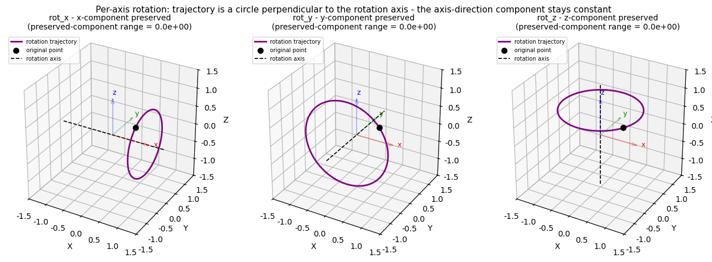
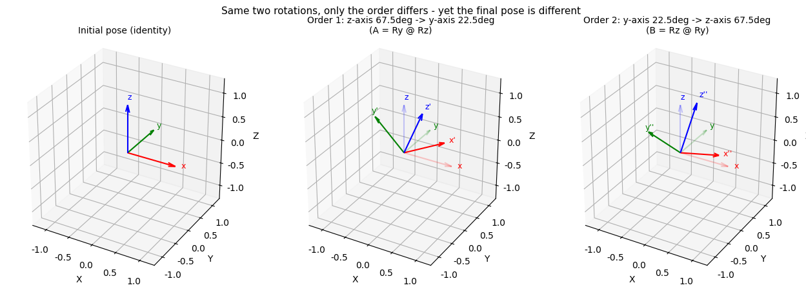
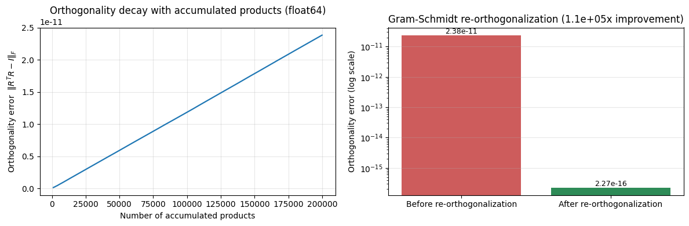
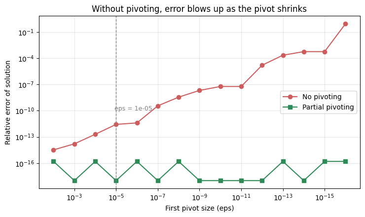
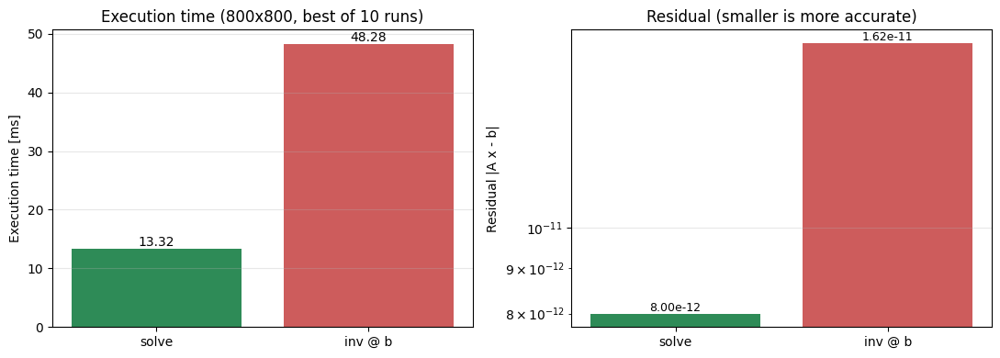
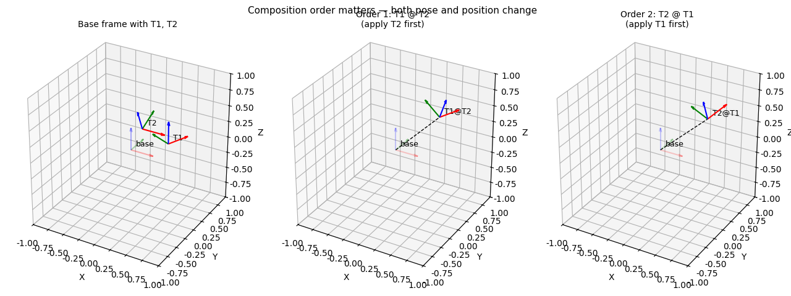
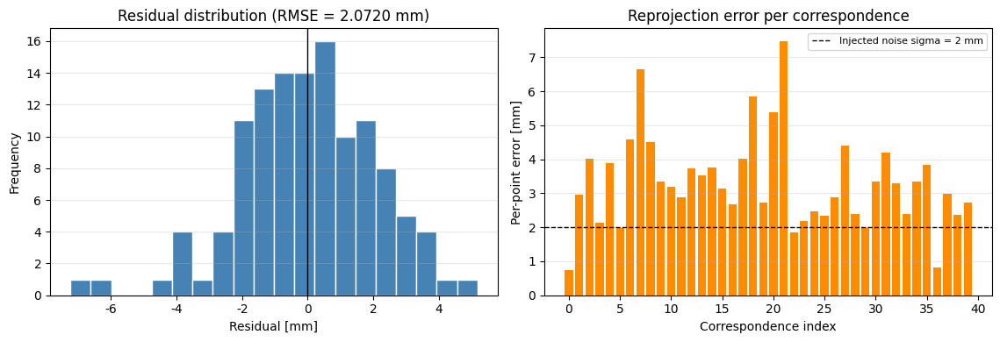
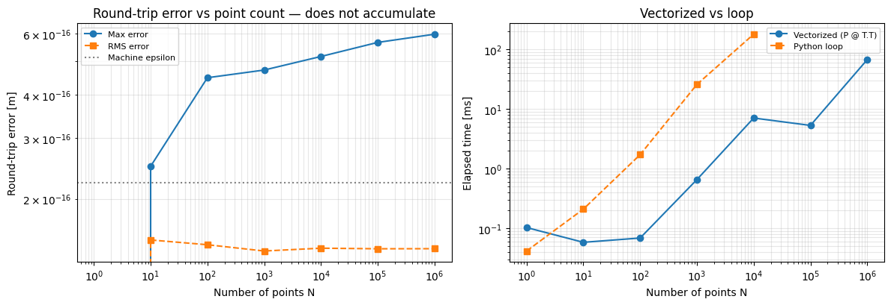
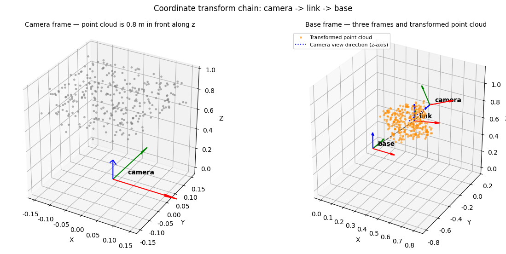
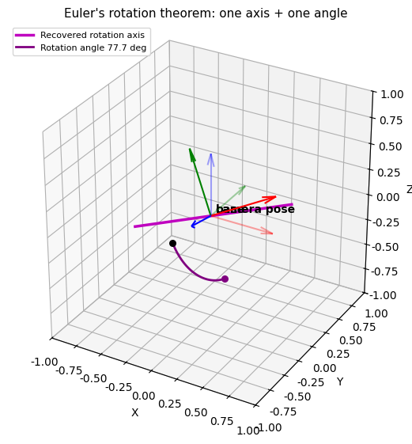

# 모듈 3 과제 - 좌표 변환과 수학 라이브러리

## 문제 1. 벡터 연산 모듈 — 내적·외적·정사영·rank

1. **내적**: `120.0` / **사이각**: `44.76027`도 — 손계산과 일치 여부: `True`

2. **영벡터 정규화 시 결과**: `0/0`이라 `[nan, nan, nan]`이 나오고 `RuntimeWarning`이 뜸, `nan`은 자기 자신과도 같지 않아 (`raw[0] == raw[0]` → `False`) `==`/`assert`로는 잡히지 않음
   - 선택한 처리: 벡터 크기가 `eps`(`1e-12`) 미만이면 `ValueError`를 던짐
   - 근거: 영벡터는 방향이 정의되지 않으므로 아무 값이나 반환하면 `nan`처럼 조용히 전파되는 버그가 된다. 문제 지점에서 바로 예외를 던지는 fail-fast 방식이 더 안전함

3. **정사영 검증**: 수직성 `True` / 합 복원 `True`
   - `project(a,b) = [4.4, 0., 2.2]`, `reject(a,b) = [-1.4, 1., 2.8]`

4. **`skew(a) @ b` 와 `np.cross(a, b)` 일치**: `True` (무작위 200쌍 검증에서도 전부 일치)

5. **세 벡터 (2,1,0),(1,3,1),(3,4,1)의 rank**: `2`
   - 3이 아닌 이유
	   - `v3 = v1 + v2` (선형종속) → 세 벡터가 서로 독립이 아님
   - 행렬식 값: `0.0` — rank < 3과 det = 0이 서로 일관됨

---

## 2. 회전 행렬 구현과 합성 순서 검증

1. **`rot_z(22.5도)`로 변환한 (1,0,0)**: `[0.92388, 0.382683, 0.]` — 손계산 기대값 `(0.923880, 0.382683, 0)`과 일치 여부: `True`

2. **축별 회전 3D 시각화**
   - 궤적의 모양: 각 축 회전에서 궤적은 회전축에 수직인 원이다.
   - 보존되는 성분: 회전축 방향 성분의 변화폭은 x, y, z 모두 `0.00e+00`(기계정밀도 수준)이다. 회전축에 해당하는 행/열이 표준기저벡터이므로 그 성분이 다른 성분과 섞이지 않고, 회전축 벡터 자체가 고유값 1의 고유벡터가 되어 변하지 않는다.



3. **합성 순서 비교** — 두 결과 행렬이 다른가: `True` (최대 성분 차이 `0.3536`)


   - 순서가 결과를 바꾸는 이유: 행렬 곱은 교환법칙이 성립하지 않는다. 먼저 적용한 회전이 다음 회전의 회전축 자체를 함께 돌려 놓기 때문에, 어느 것을 먼저 적용하느냐에 따라 최종 자세가 달라진다.

4. **세 회전 행렬의 행렬식**: `1.0000` / **반사 행렬 `diag(1,-1,1)`의 행렬식**: `-1.0000`
   - 차이의 의미 
	   - det = +1인 직교행렬만 오른손 좌표계를 보존하는 순수 회전임
	   - det = -1인 직교행렬은 반사(거울상)가 섞여 있어 어떤 회전을 곱해도 -1이 유지되며, 로봇 자세 계산에 이런 행렬이 섞이면 팔이 물리적으로 불가능한 뒤집힌 자세로 계산됨

5. **로드리게스 구현과 `rot_z` 일치**: `True` (임의 축에서도 det = 1, 직교, `R k = k` 확인: `True`)

---

## 3. 재직교화와 pytest 검증

1. **20만 번 누적 후 직교성 오차**: `2.3837e-11` (`||R^T R - I||_F` 기준)
	   - float32로 하면: `6.0847e-03` (float64 대비 약 `2.553억`배)


2. **재직교화 후 오차**: `2.2652e-16` — 개선 배율: `약 1.05 × 10^5`배

3. **복구 행렬의 행렬식**: `1.0000000000000002` (직교 + det=1이므로 회전행렬: `True`)

4. **`pytest -v` 전수 통과 출력** 
	- 노트북 코드가 `result.stdout[-6000:]`로 마지막 부분만 출력하도록 되어 있어 앞부분 일부는 잘려 있음. 전체 83개 케이스가 통과했다는 요약 줄은 그대로 남아 있음

```bash
ROOT = [/home/pa34/Desktop/physical_ai/projects/assignment/assign_lv1/lv1_module3](https://file+.vscode-resource.vscode-cdn.net/home/pa34/Desktop/physical_ai/projects/assignment/assign_lv1/lv1_module3)

누적 후 직교성 오차 err_before = 2.3836779644979223e-11 누적 후 행렬식 det_before = 0.9999999999815234 각 열의 길이 = [1. 1. 1.] (검산용)

float32 누적 후 직교성 오차 err32 = 0.0060846852982080445 float64 대비 배율 = 255264569.66218886

[PASS] 누적 후 직교성이 실제로 무너졌다 (오차 > 0) [PASS] 한 번만 곱했을 때는 오차가 거의 0 [PASS] 기록이 200개 (1000회마다) [PASS] 오차가 누적 횟수에 따라 증가 [PASS] 누적 오차가 float64 에서 1e-12 ~ 1e-9 범위 (구현이 맞다면) [PASS] float32 가 float64 보다 훨씬 크게 무너진다 (1000배 이상) 3-1 전체 통과: True

def gram_schmidt(A) -> np.ndarray: A = np.array(A, dtype=float, copy=True) # 직교화 하고자 하는 행렬 n_cols = A.shape[1] Q = np.zeros_like(A) # 결과가 저장되는 단위행렬 eps = 1e-10 for j in range(n_cols): v = A[:, j].copy() for i in range(j): v -= dot(Q[:,i], v) * Q[:,i] nv = norm(v) # v 크기 if nv < eps: raise ValueError(f"{j}번 열이 앞선 열들에 종속이므로 직교화 불가") Q[:,j] = v [/](https://file+.vscode-resource.vscode-cdn.net/) nv return Q

재직교화 후 오차 err_after = 2.2652158746862216e-16 행렬식 det_after = 1.0000000000000002 개선 배율 = 105229.61591146849 원래 행렬과의 최대 차이 = 5.9037219557467324e-12

[PASS] 재직교화 후 오차가 전보다 작다 [PASS] 재직교화 후 오차가 기계정밀도 수준 (< 1e-14) [PASS] 복구 행렬의 행렬식이 1 [PASS] 복구 행렬이 진짜 회전행렬 (직교 + det=1) [PASS] 복구 행렬의 역행렬 == 전치 [PASS] 자세가 크게 바뀌지 않았다 (차이 < 1e-6) [PASS] 이미 직교인 행렬에 적용하면 그대로 [PASS] 노이즈 섞인 행렬도 회전행렬로 복구 3-2 전체 통과: True

[32m [ 32%] tests/test_rotation.py::test_determinant_is_one[0.39269908169872414-rot_x] PASSED [ 33%] tests/test_rotation.py::test_determinant_is_one[0.39269908169872414-rot_y] PASSED [ 34%] tests/test_rotation.py::test_determinant_is_one[0.39269908169872414-rot_z] PASSED [ 36%] tests/test_rotation.py::test_determinant_is_one[0.5235987755982988-rot_x] PASSED [ 37%] tests/test_rotation.py::test_determinant_is_one[0.5235987755982988-rot_y] PASSED [ 38%] tests/test_rotation.py::test_determinant_is_one[0.5235987755982988-rot_z] PASSED [ 39%] tests/test_rotation.py::test_determinant_is_one[0.7853981633974483-rot_x] PASSED [ 40%] tests/test_rotation.py::test_determinant_is_one[0.7853981633974483-rot_y] PASSED [ 42%] tests/test_rotation.py::test_determinant_is_one[0.7853981633974483-rot_z] PASSED [ 43%] tests/test_rotation.py::test_determinant_is_one[1.5707963267948966-rot_x] PASSED [ 44%] tests/test_rotation.py::test_determinant_is_one[1.5707963267948966-rot_y] PASSED [ 45%] tests/test_rotation.py::test_determinant_is_one[1.5707963267948966-rot_z] PASSED [ 46%] tests/test_rotation.py::test_determinant_is_one[2.0-rot_x] PASSED [ 48%] tests/test_rotation.py::test_determinant_is_one[2.0-rot_y] PASSED [ 49%] tests/test_rotation.py::test_determinant_is_one[2.0-rot_z] PASSED [ 50%] tests/test_rotation.py::test_determinant_is_one[3.141592653589793-rot_x] PASSED [ 51%] tests/test_rotation.py::test_determinant_is_one[3.141592653589793-rot_y] PASSED [ 53%] tests/test_rotation.py::test_determinant_is_one[3.141592653589793-rot_z] PASSED [ 54%] tests/test_rotation.py::test_determinant_is_one[-1.234-rot_x] PASSED [ 55%] tests/test_rotation.py::test_determinant_is_one[-1.234-rot_y] PASSED [ 56%] tests/test_rotation.py::test_determinant_is_one[-1.234-rot_z] PASSED [ 57%] tests/test_rotation.py::test_inverse_equals_transpose[0.0-rot_x] PASSED [ 59%] tests/test_rotation.py::test_inverse_equals_transpose[0.0-rot_y] PASSED [ 60%] tests/test_rotation.py::test_inverse_equals_transpose[0.0-rot_z] PASSED [ 61%] tests/test_rotation.py::test_inverse_equals_transpose[0.39269908169872414-rot_x] PASSED [ 62%] tests/test_rotation.py::test_inverse_equals_transpose[0.39269908169872414-rot_y] PASSED [ 63%] tests/test_rotation.py::test_inverse_equals_transpose[0.39269908169872414-rot_z] PASSED [ 65%] tests/test_rotation.py::test_inverse_equals_transpose[0.5235987755982988-rot_x] PASSED [ 66%] tests/test_rotation.py::test_inverse_equals_transpose[0.5235987755982988-rot_y] PASSED [ 67%] tests/test_rotation.py::test_inverse_equals_transpose[0.5235987755982988-rot_z] PASSED [ 68%] tests/test_rotation.py::test_inverse_equals_transpose[0.7853981633974483-rot_x] PASSED [ 69%] tests/test_rotation.py::test_inverse_equals_transpose[0.7853981633974483-rot_y] PASSED [ 71%] tests/test_rotation.py::test_inverse_equals_transpose[0.7853981633974483-rot_z] PASSED [ 72%] tests/test_rotation.py::test_inverse_equals_transpose[1.5707963267948966-rot_x] PASSED [ 73%] tests/test_rotation.py::test_inverse_equals_transpose[1.5707963267948966-rot_y] PASSED [ 74%] tests/test_rotation.py::test_inverse_equals_transpose[1.5707963267948966-rot_z] PASSED [ 75%] tests/test_rotation.py::test_inverse_equals_transpose[2.0-rot_x] PASSED [ 77%] tests/test_rotation.py::test_inverse_equals_transpose[2.0-rot_y] PASSED [ 78%] tests/test_rotation.py::test_inverse_equals_transpose[2.0-rot_z] PASSED [ 79%] tests/test_rotation.py::test_inverse_equals_transpose[3.141592653589793-rot_x] PASSED [ 80%] tests/test_rotation.py::test_inverse_equals_transpose[3.141592653589793-rot_y] PASSED [ 81%] tests/test_rotation.py::test_inverse_equals_transpose[3.141592653589793-rot_z] PASSED [ 83%] tests/test_rotation.py::test_inverse_equals_transpose[-1.234-rot_x] PASSED [ 84%] tests/test_rotation.py::test_inverse_equals_transpose[-1.234-rot_y] PASSED [ 85%] tests/test_rotation.py::test_inverse_equals_transpose[-1.234-rot_z] PASSED [ 86%] tests/test_rotation.py::test_gram_schmidt_restores_orthogonality PASSED [ 87%] tests/test_rotation.py::test_reflection_is_not_a_rotation PASSED [ 89%] tests/test_rotation.py::test_rodrigues_matches_rot_z[0.0] PASSED [ 90%] tests/test_rotation.py::test_rodrigues_matches_rot_z[0.39269908169872414] PASSED [ 91%] tests/test_rotation.py::test_rodrigues_matches_rot_z[0.5235987755982988] PASSED [ 92%] tests/test_rotation.py::test_rodrigues_matches_rot_z[0.7853981633974483] PASSED [ 93%] tests/test_rotation.py::test_rodrigues_matches_rot_z[1.5707963267948966] PASSED [ 95%] tests/test_rotation.py::test_rodrigues_matches_rot_z[2.0] PASSED [ 96%] tests/test_rotation.py::test_rodrigues_matches_rot_z[3.141592653589793] PASSED [ 97%] tests/test_rotation.py::test_rodrigues_matches_rot_z[-1.234] PASSED [ 98%] tests/test_rotation.py::test_axis_angle_roundtrip PASSED [100%] ============================== 83 passed in 0.13s ============================== 종료 코드 : 0
```

5. **함수를 틀리게 바꿨을 때 실패 출력** 
	- `rot_z`의 두 번째 행 `[s, c, 0]` → `[-s, c, 0]`로 부호 하나 반전, 종료 코드 `1`
```bash
Error: det(R) = -0.6536436208636118 (1 이어야 함) [/home/pa34/Desktop/physical_ai/projects/assignment/assign_lv1/lv1_module3/tests/test_rotation.py](https://file+.vscode-resource.vscode-cdn.net/home/pa34/Desktop/physical_ai/projects/assignment/assign_lv1/lv1_module3/tests/test_rotation.py):66: AssertionError: det(R) = -0.7815856246942798 (1 이어야 함) [/home/pa34/Desktop/physical_ai/projects/assignment/assign_lv1/lv1_module3/tests/test_rotation.py](https://file+.vscode-resource.vscode-cdn.net/home/pa34/Desktop/physical_ai/projects/assignment/assign_lv1/lv1_module3/tests/test_rotation.py):75: AssertionError: inv(R) != R.T [/home/pa34/Desktop/physical_ai/projects/assignment/assign_lv1/lv1_module3/tests/test_rotation.py](https://file+.vscode-resource.vscode-cdn.net/home/pa34/Desktop/physical_ai/projects/assignment/assign_lv1/lv1_module3/tests/test_rotation.py):75: AssertionError: inv(R) != R.T [/home/pa34/Desktop/physical_ai/projects/assignment/assign_lv1/lv1_module3/tests/test_rotation.py](https://file+.vscode-resource.vscode-cdn.net/home/pa34/Desktop/physical_ai/projects/assignment/assign_lv1/lv1_module3/tests/test_rotation.py):75: AssertionError: inv(R) != R.T [/home/pa34/Desktop/physical_ai/projects/assignment/assign_lv1/lv1_module3/tests/test_rotation.py](https://file+.vscode-resource.vscode-cdn.net/home/pa34/Desktop/physical_ai/projects/assignment/assign_lv1/lv1_module3/tests/test_rotation.py):75: AssertionError: inv(R) != R.T [/home/pa34/Desktop/physical_ai/projects/assignment/assign_lv1/lv1_module3/tests/test_rotation.py](https://file+.vscode-resource.vscode-cdn.net/home/pa34/Desktop/physical_ai/projects/assignment/assign_lv1/lv1_module3/tests/test_rotation.py):75: AssertionError: inv(R) != R.T [/home/pa34/Desktop/physical_ai/projects/assignment/assign_lv1/lv1_module3/tests/test_rotation.py](https://file+.vscode-resource.vscode-cdn.net/home/pa34/Desktop/physical_ai/projects/assignment/assign_lv1/lv1_module3/tests/test_rotation.py):105: assert False [/home/pa34/Desktop/physical_ai/projects/assignment/assign_lv1/lv1_module3/tests/test_rotation.py](https://file+.vscode-resource.vscode-cdn.net/home/pa34/Desktop/physical_ai/projects/assignment/assign_lv1/lv1_module3/tests/test_rotation.py):105: assert False [/home/pa34/Desktop/physical_ai/projects/assignment/assign_lv1/lv1_module3/tests/test_rotation.py](https://file+.vscode-resource.vscode-cdn.net/home/pa34/Desktop/physical_ai/projects/assignment/assign_lv1/lv1_module3/tests/test_rotation.py):105: assert False [/home/pa34/Desktop/physical_ai/projects/assignment/assign_lv1/lv1_module3/tests/test_rotation.py](https://file+.vscode-resource.vscode-cdn.net/home/pa34/Desktop/physical_ai/projects/assignment/assign_lv1/lv1_module3/tests/test_rotation.py):105: assert False [/home/pa34/Desktop/physical_ai/projects/assignment/assign_lv1/lv1_module3/tests/test_rotation.py](https://file+.vscode-resource.vscode-cdn.net/home/pa34/Desktop/physical_ai/projects/assignment/assign_lv1/lv1_module3/tests/test_rotation.py):105: assert False [/home/pa34/Desktop/physical_ai/projects/assignment/assign_lv1/lv1_module3/tests/test_rotation.py](https://file+.vscode-resource.vscode-cdn.net/home/pa34/Desktop/physical_ai/projects/assignment/assign_lv1/lv1_module3/tests/test_rotation.py):105: assert False [/home/pa34/Desktop/physical_ai/projects/assignment/assign_lv1/lv1_module3/tests/test_rotation.py](https://file+.vscode-resource.vscode-cdn.net/home/pa34/Desktop/physical_ai/projects/assignment/assign_lv1/lv1_module3/tests/test_rotation.py):114: AssertionError: 축·각으로 되돌린 행렬이 원본과 다릅니다 =========================== short test summary info ============================ FAILED tests/test_rotation.py::test_columns_are_orthonormal[0.39269908169872414-rot_z] - AssertionError: 열 0, 1 가 직교하지 않습니다 FAILED tests/test_rotation.py::test_columns_are_orthonormal[0.5235987755982988-rot_z] - AssertionError: 열 0, 1 가 직교하지 않습니다 FAILED tests/test_rotation.py::test_columns_are_orthonormal[0.7853981633974483-rot_z] - AssertionError: 열 0, 1 가 직교하지 않습니다 FAILED tests/test_rotation.py::test_columns_are_orthonormal[2.0-rot_z] - AssertionError: 열 0, 1 가 직교하지 않습니다 FAILED tests/test_rotation.py::test_columns_are_orthonormal[-1.234-rot_z] - AssertionError: 열 0, 1 가 직교하지 않습니다 FAILED tests/test_rotation.py::test_determinant_is_one[0.39269908169872414-rot_z] - AssertionError: det(R) = 0.7071067811865475 (1 이어야 함) FAILED tests/test_rotation.py::test_determinant_is_one[0.5235987755982988-rot_z] - AssertionError: det(R) = 0.5000000000000002 (1 이어야 함) FAILED tests/test_rotation.py::test_determinant_is_one[0.7853981633974483-rot_z] - AssertionError: det(R) = 1.5700924586837776e-16 (1 이어야 함) FAILED tests/test_rotation.py::test_determinant_is_one[1.5707963267948966-rot_z] - AssertionError: det(R) = -1.0 (1 이어야 함) FAILED tests/test_rotation.py::test_determinant_is_one[2.0-rot_z] - AssertionError: det(R) = -0.6536436208636118 (1 이어야 함) FAILED tests/test_rotation.py::test_determinant_is_one[-1.234-rot_z] - AssertionError: det(R) = -0.7815856246942798 (1 이어야 함) FAILED tests/test_rotation.py::test_inverse_equals_transpose[0.39269908169872414-rot_z] - AssertionError: inv(R) != R.T FAILED tests/test_rotation.py::test_inverse_equals_transpose[0.5235987755982988-rot_z] - AssertionError: inv(R) != R.T FAILED tests/test_rotation.py::test_inverse_equals_transpose[0.7853981633974483-rot_z] - AssertionError: inv(R) != R.T FAILED tests/test_rotation.py::test_inverse_equals_transpose[2.0-rot_z] - AssertionError: inv(R) != R.T FAILED tests/test_rotation.py::test_inverse_equals_transpose[-1.234-rot_z] - AssertionError: inv(R) != R.T FAILED tests/test_rotation.py::test_rodrigues_matches_rot_z[0.39269908169872414] - assert False FAILED tests/test_rotation.py::test_rodrigues_matches_rot_z[0.5235987755982988] - assert False FAILED tests/test_rotation.py::test_rodrigues_matches_rot_z[0.7853981633974483] - assert False FAILED tests/test_rotation.py::test_rodrigues_matches_rot_z[1.5707963267948966] - assert False FAILED tests/test_rotation.py::test_rodrigues_matches_rot_z[2.0] - assert False FAILED tests/test_rotation.py::test_rodrigues_matches_rot_z[-1.234] - assert False FAILED tests/test_rotation.py::test_axis_angle_roundtrip - AssertionError: 축·각으로 되돌린 행렬이 원본과 다릅니다 23 failed, 60 passed in 0.15s 종료 코드 : 1 (0 이 아니어야 정상 — 테스트가 버그를 잡았다는 뜻)
```

   - 원본 복구 후 재실행
	   - (test_rotation.py 83개 + test_transform.py 6개), 종료 코드 `0`
```bash
........................................................................ [ 80%] ................. [100%] 89 passed in 0.14s 복구 후 종료 코드 : 0
```


---

## 4. 연립방정식과 해의 판정 — 가우스 소거·rank·역행렬

1. **가우스 소거 단계별 첨가행렬**
   ```text
   초기 [A|b] = [[3, 1, 2, 11], [1, 4, 1, 1], [2, -1, 5, 20]]
   열 0 소거 후 = [[3, 1, 2, 11], [0, 3.6667, 0.3333, -2.6667], [0, -1.6667, 3.6667, 12.6667]]
   열 1 소거 후 = [[3, 1, 2, 11], [0, 3.6667, 0.3333, -2.6667], [0, 0, 3.8182, 11.4545]]
   ```
- 최종 해: `x = (2, -1, 3)` (정수로 떨어짐: `True`, `np.linalg.solve`와 일치)
   
2. **rank A**: `3` / **rank 첨가행렬**: `3` (미지수 3개) - 두 rank가 같고 n과 같으므로 **유일해**.
   - 모순 케이스(`rank(A) < rank([A|b])`)면 해가 없고, 같지만 n보다 작으면 자유변수가 생겨 해가 무한히 많다.

3. **행렬식**: `42.0`
   **역행렬**:
   ```text
   [[ 0.5      -0.166667 -0.166667]
    [-0.071429  0.261905 -0.02381 ]
    [-0.214286  0.119048  0.261905]]
   ```
   - det이 0에 가까울 때 위험한 이유
	   - `A^-1 = adj(A)/det(A)`에서 아주 작은 det로 나누면 값이 폭발적으로 커지고, 소거 관점에서도 작은 피벗으로 나누는 것과 같아 반올림 오차가 증폭됨
	   - det은 스케일에 민감하므로(`det(cA) = c^n det(A)`) 특이성 판정에는 스케일 무관인 조건수(`np.linalg.cond`)가 더 적합함

4. **피벗팅 없을 때 오차 vs 부분 피벗팅 적용 시 오차** (`eps = 1e-5`): `2.690e-12` / `0.000e+00`


   - eps를 `1e-16`까지 줄이면 피벗팅 없는 쪽 오차는 `8.630e-01`까지 커져 해가 완전히 무너지고, 부분 피벗팅은 `eps`와 무관하게 기계정밀도(`~1.57e-16`) 수준을 유지

5. **`solve` vs 역행렬 곱셈 비교** (800×800, 10회 중 최솟값 기준)

| 방법 | 실행시간 | 잔차 |
|---|---|---|
| `np.linalg.solve` | `13.317 ms` | `8.001e-12` |
| `inv(A) @ b` | `48.281 ms` | `1.619e-11` |


   - 결론
	   - `solve`는 역행렬을 따로 만들지 않고 LU 분해로 바로 풀어 연산량(`~2/3 n^3`, 역행렬 방식은 `~2n^3`)과 메모리가 더 적고 수치적으로도 더 안정적임
	   - 조건수를 `1e2 → 1e14`로 키우면 두 방법 모두 오차가 커지지만(`solve`: `3.7e-14 → 1.6e-3`, `inv`: `2.5e-13 → 5.1e-2`) 역행렬 방식이 대체로 더 크게 나빠짐
	   - 따라서 실무에서는 특수한 경우가 아니면 항상 `solve`를 쓴다.

---

## 5. 동차변환 4×4 모듈과 최소자승법

1. **역변환 검증**: `T @ inv_T(T) == I` 여부 `True` / `np.linalg.inv(T)`와 일치 여부 `True`

2. **점 변환 결과**: `[0.703553, -0.003553, 1.47388]` / **방향 변환 결과**: `[0.353553, 0.146447, 0.92388]`
   - 차이의 이유
	   - 점은 위치라 병진이 함께 적용되고(`w=1`), 방향(속도·힘·법선 등)은 위치가 아니라 변화량이므로 회전만 적용되고 병진은 무시됨(`w=0`)
	   - 두 결과의 차이는 병진 벡터 `t = [0.35, -0.15, 0.55]`와 정확히 같음

3. **합성 순서 비교 그림**
   

   - `T1@T2` 병진 `[0.461209, 0.407716, 0.45]` vs `T2@T1` 병진 `[0.6, 0.242702, 0.538059]` — 회전이 상대 병진에 곱해져 걸리므로(`T1 T2`의 병진 = `R1 t2 + t1`) 어느 회전이 먼저 적용되느냐에 따라 최종 위치가 달라짐

4. **`inv_T` vs 일반 역행렬 속도**: 단건 `3.951 us` / `3.834 us`, 배치(3000개) `0.130 ms` / `0.917 ms`
   - 차이의 이유
	   - 단건에서는 실제 연산이 수십 flops(나노초)뿐이라 함수 호출·배열 생성 오버헤드가 지배해 차이가 잘 드러나지 않음
	   - 배치로 묶으면 오버헤드가 상수화되어, `np.linalg.inv`의 LU 분해 대비 `inv_T`의 전치 공식이 갖는 연산량 차이가 그대로 시간 차이로 드러남

5. **최소자승 해**: `M_hat`이 `M_true`에 근접 (오차 6mm 이내) — `lstsq`와 일치 여부: `True`, 잔차 RMSE: `0.0020720`(≈ `2.072mm`, 주입 노이즈 σ = `2mm`와 같은 자릿수)
   

   - 잔차가 설계행렬 열공간에 수직(`|A^T r| = 1.634e-15`)임을 확인해 최소자승 조건을 만족시킴을 검증함

---

## 6. 좌표 변환 체인과 회전축 복원

1. **카메라 좌표에서 base 좌표로의 변환 결과**: `p_cam = [0.15, -0.08, 0.65]` → `p_base = [0.753304, -0.422788, 0.848928]`
   - 사용한 체인: `T(base<-camera) = T(base<-link) @ T(link<-camera)` (base→link: z축 22.5도 + `(0.35,0.05,0.45)`, link→camera: `rot_y(-22.5°)@rot_x(67.5°)` + `(0.12,0.04,0.18)`)

2. **왕복 검증**: 단일 점 오차 `1.501e-16`, 점군 100만 개에서 최대 `5.979e-16` (누적되지 않음)   

   - 벡터화가 반복문보다 1만 개 기준 약 `25.5배` 빠름

3. **좌표계와 점군 3D 시각화**


   - 기하적으로 타당하다고 판단한 근거: 점군의 중심이 카메라 z축(시선) 방향 약 `0.8m` 앞에 놓여 있고, base 기준으로 옮긴 뒤에도 점군의 퍼짐(분산)이 그대로 보존되기 때문

4. **복원한 회전축**: `[0.902216, -0.084139, 0.422998]` / **회전각**: `77.7205`도 — 축 불변 검증(`|R k - k|`): `1.110e-16` (`True`)
   

   - 방법: 고유값 1에 대응하는 고유벡터가 회전축이고, `trace(R) = 1 + 2cos(theta)`로 각을 구한 뒤 반대칭 성분 `R - R^T = 2 sin(theta) [k]_x`로 축의 부호를 고정

5. **쿼터니언 비교** (x, y, z, w)
   - 직접 계산: `[0.566071, -0.052791, 0.265399, 0.778679]`
   - SciPy: `[0.566071, -0.052791, 0.265399, 0.778679]`
   - 부호 무시하고 일치: `True` (`|q · q_scipy| = 1.000000`)
   - 부호 차이의 이유
	   - 쿼터니언은 회전을 이중으로 덮음 (`q`와 `-q`가 같은 회전을 나타냄)
	   - 축을 반대로 잡고 각을 `2π - θ`로 잡아도 같은 회전이 되므로, 구현 방식에 따라 어느 쪽 부호가 나오는지가 갈릴 수 있음
