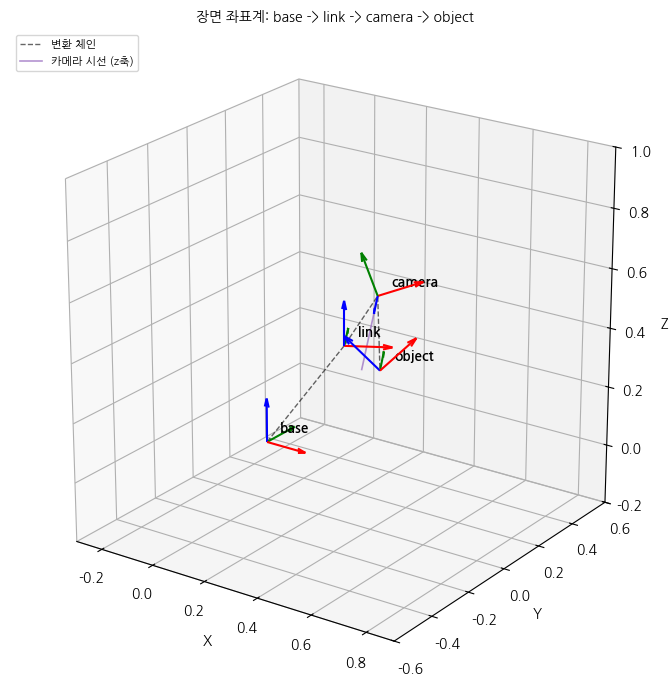
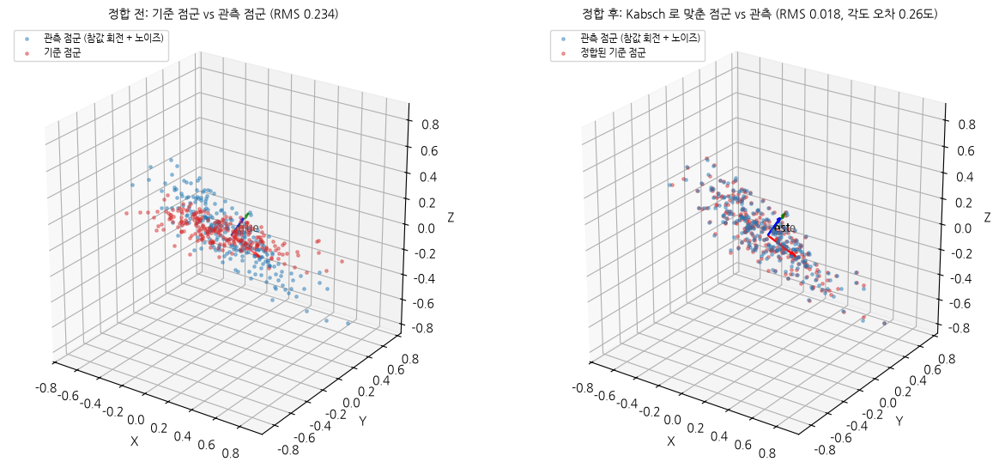
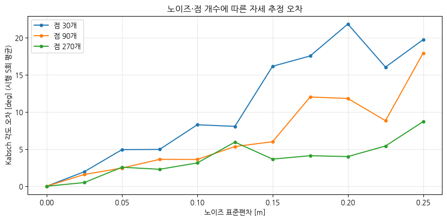

# 모듈 4 발표 자료 — 픽앤플레이스 자세 추정과 궤적 생성

> 이름: 정조은 / 제출일: 2026-09-09

---

## 1. 파이프라인 전체 구조

- 좌표계 체인 (base -> link -> camera -> object) 그림 또는 다이어그램
	- `base -> link -> camera -> object` 순서 이어짐
	- 각 화살표는 모듈 3 `make_T`로 만든 4x4 동차변환

$$T^{base}_{obj} = T^{base}_{link}\,T^{link}_{cam}\,T^{cam}_{obj}$$

| 변환                               | 회전                                 | 병진 [m]                            |
| -------------------------------- | ---------------------------------- | --------------------------------- |
| `T_base_link` = T(base ← link)   | z축 30도                             | (0.30, 0.00, 0.40)                |
| `T_link_cam` = T(link ← camera)  | y축 -20도 후 x축 90도 (`rot_y @ rot_x`) | (0.10, 0.05, 0.15)                |
| `T_cam_obj` = T(camera ← object) | z축 25도 후 x축 -90도 (`rot_z @ rot_x`) | (0.05, -0.02, 0.60) — 카메라 앞 60 cm |

  
- 각 노트북·모듈이 맡는 역할 (01 파이프라인 / 02 보간 / 03 자세 추정·시연)
	1) **`01_pipeline.ipynb`**
		- 환경 확인과 좌표계 정의
		- `camera → base` 변환 파이프라인(`PosePipeline`) 구현
			- `base → link`·`link → camera` 변환을 저장하고, property로 `T_base_link`, `T_link_camera`, `T_base_camera`, `T_camera_base`를 그때그때 계산해 반환
			- `set_joint_angle(theta)`로 관절각을 바꾸고, `camera_to_base`, `base_to_camera`로 점군(N×3)을 반복문 없이 변환
			- `object_pose_in_base(T_camera_object)`로 카메라 기준 물체 자세를 base 기준으로 옮김
			 
	2) **`02_interpolation.ipynb`**
		- 회전 보간: `src/quaternion.py` 
			- `matrix_to_quaternion`/`quaternion_to_matrix`: 회전행렬 ↔ 쿼터니언 왕복 변환 구현 (SciPy와 비교해 검증)
			- `slerp`로 두 자세 사이를 구면 선형보간 → <u>등각속도</u> (연속 자세 사이 각도가 항상 동일)로 보간됨을 확인
			- `lerp_quat`(단순 선형보간)과 비교
				- LERP는 중간에서 노름이 1보다 작아져(비단위 쿼터니언) 자세로 못 씀
				  → 정규화(NLERP)해도 등각속도가 깨짐 → SLERP가 필요한 이유
			- 거의 같은 자세, 부호가 반대인 쿼터니언(-q), 정반대(180도) 자세 등 경계 케이스에서 NaN 없이 안전하게 처리되는지 확인
		- 궤적 보간: `src/trajectory.py`
			- `linear_interp`(선형)와 `cubic_spline_interp`(3차 스플라인)로 경유점을 지나는 위치 궤적 생성 → 관절각(1D)과 3D 위치 모두에 적용
			- `finite_diff`로 두 방식의 속도·가속도를 수치미분해 비교
				- 선형보간은 경유점에서 속도가 꺾이고 가속도가 스파이크로 튐
				- 큐빅 스플라인은 가속도까지 연속이라 부드러움
			- `quintic_profile`(5차 다항식)로 시작·끝, 속도·가속도가 정확히 0인 매끄러운 프로파일 생성 (정지→정지 구간용)
			
	3) **`03_pose_estimation.ipynb`**
		- 자세 추정: `src/pose_estimation.py`
			- `pca_axes`: 점군 공분산을 고유분해해 물체의 주축 3개(긴 축→짧은 축)와 고유값을 추출 → 길쭉한 점군은 주축이 안정적이지만 구형에 가까운 점군은 주축 방향이 표본마다 크게 흔들림을 비교
			- `kabsch`: 대응이 알려진 두 점군 사이 최적 회전·병진을 SVD로 구함 - 노이즈·점 개수를 바꿔가며 각도 오차가 어떻게 변하는지 확인
			- `fit_plane_lstsq` + `remove_outliers`: 최소제곱으로 평면을 피팅하고 MAD 기반으로 이상치를 걸러낸 뒤, 이상치 제거 전후 Kabsch 오차 비교
			- 시연: 문제 3(SLERP)·4(스플라인 궤적)·5(자세 추정) 결과를 결합 - 카메라로 관측한 점군에서 PCA로 물체 자세를 추정하고, 모듈 3 `default_chain`으로 구한 `base ← camera` 변환을 곱해 base 기준 목표 자세로 변환
			- 그리퍼의 현재 자세 → 목표 자세까지 SLERP(회전) + 3차 스플라인(위치)으로 궤적을 만들어 애니메이션으로 시연하고 `demo.gif`로 저장
			- 자세 변화의 균일성(프레임 간 각도 변화 표준편차)과 위치 가속도의 연속성(스플라인 vs 선형 비교)을 정량 지표로 확인

- **데이터 흐름**
	- 카메라 점군 -> `PosePipeline` -> base 점군 -> PCA/Kabsch -> 목표 자세 -> SLERP + 스플라인 -> 애니메이션

- **모듈 3 에서 가져온 함수와 이번에 새로 만든 함수 구분**
	- 모듈 3에서 그대로 가져온 것
		- `rotation.py` (`rot_x/y/z`, `rodrigues`, `axis_angle_from_matrix`, `quaternion_from_axis_angle`)
		- `transform.py` (`make_T`, `inv_T`, `transform_points`),
		- `coordinate_chain.py`(`CoordinateChain`, `default_chain`)
	- 이번 모듈에서 새로 구현한 것
		- `pose_pipeline.py`, `quaternion.py`, `trajectory.py`, `pose_estimation.py`

---

## 2. 자세 추정 결과와 오차

- PCA 주축 3개와 고유값
	- 주축 (열벡터):  열0 -`[-0.999, 0.037, 0.008]`, 열1 - `[0.037, 0.999, -0.031]`, 열2 - `[-0.009, -0.031, -0.999]`
	- 고유값: `[0.0995, 0.0103, 0.0025]`
	- 표준편차 환산 시 약 0.315, 0.101, 0.050으로 점군 생성에 쓴 0.35, 0.10, 0.05과 비슷한 크기

- Kabsch 로 추정한 회전과 참값 사이 각도 오차: **0.258** 도, 병진 오차: **8.7e-5 m**

- 이상치 제거 전후 오차: **2.416도** -> **0.185도** (주입한 이상치 12개 중 100% 검출·제거)

- 정합 전후 그림 (03 노트북 캡처): 정합 전 RMS 0.234 -> 정합 후 RMS 0.018로 크게 줄어듦

  

---

## 3. 노이즈·점 개수가 정확도에 미친 영향

- 노이즈 0 ~ 0.25 스윕에서 오차가 어떻게 커졌는가
	- 노이즈 표준편차가 커질수록 세 점 개수 계열 모두 각도 오차가 대체로 증가함 (시행 횟수가 5회로 적어 구간별 변동은 있지만 전반적인 증가 추세가 뚜렷함)
	- 점 270개 기준 노이즈 0에서 0도였던 오차가 노이즈 0.25에서 약 8.7도까지 커짐

- 점 개수 30 / 90 / 270 계열 비교 — 점이 많을수록 오차가 줄어드는 정도 (대략 몇 배)
	- 고노이즈 구간(0.175~0.25) 평균으로 비교하면 점 30개일 때 오차가 점 270개일 때보다 **약 3.4배** 컸다 → 점이 많을수록 확실히 더 안정적으로 자세 추정 가능

- 구형 점군에서 PCA 주축이 불안정해진 이유 (고유값 관점)
	- 길쭉한 점군은 λ1/λ2 비율이 약 12.37로 첫 주축이 뚜렷하지만, 구형 점군(표준편차 0.20/0.19/0.18)은 λ1/λ2가 약 1.19로 거의 같아 분산이 가장 큰 방향이 표본마다 임의로 정해짐
	- 그 결과, 20회 시행에서 첫 주축 방향이 길쭉한 점군은 2.48도만 흔들린 반면 구형 점군은 72.73도까지 흔들리게 됨

- 오차 그래프 (03 노트북 캡처)
	- 노이즈·점 개수에 따른 Kabsch 각도 오차 곡선

---

## 4. 현재 구현의 한계

- 자세 추정
	- Kabsch는 두 점군 사이의 대응(어느 점이 어느 점에 대응하는지)이 이미 알려진 경우에만 동작함
	  → 실제 카메라 관측에서는 대응이 주어지지 않으므로 별도의 정합(ICP 등) 단계가 필요
	- 물체가 좌우 대칭이면 PCA의 짧은 두 축의 부호가 모호해질 수 있음

- 궤적 생성
	- 현재 궤적은 충돌 회피나 관절 각도·속도·가속도 한계를 전혀 고려하지 않음
	- 실제 로봇에 적용하려면 작업 공간 장애물과 관절 한계를 반영한 궤적 재계획이 필요

- 파이프라인
	- `PosePipeline`은 관절을 1개(단일 회전축)로 단순화했고, 카메라 캘리브레이션 오차나 base-link-camera 변환 자체의 불확실성은 고려하지 않았음

- 시연
	- 애니메이션은 이상적인 정적 장면(정지된 카메라, 정지된 물체)만 다루며, 실시간으로 갱신되는 관측이나 동적 장애물은 반영하지 못함

---

## 5. 개선한다면 무엇을 어떻게

- 대응 없는 정합 → ICP(Iterative Closest Point)를 도입해 Kabsch가 요구하는 이미 알려진 대응이라는 가정 없이도 점군 정합이 가능하도록 개선

- 이상치에 더 강건한 평면 피팅 → 현재의 최소제곱 + MAD 기반 제거 대신 RANSAC으로 평면을 피팅해 이상치 비율이 더 높은 상황에서도 안정적으로 동작

- 매끄러운 궤적 → 관절 한계와 저크(가속도의 변화율)까지 최소화하는 최소 저크(minimum-jerk) 궤적이나 시간 최적 궤적 계획으로 바꿔 실제 로봇에 더 안전하게 적용

- 개선 효과를 어떻게 측정할 것인지
	- 노이즈·점 개수·이상치 비율을 지금과 동일하게 바꿔가며 개선 전후의 각도/병진 오차, 정합 성공률(대응 없는 경우 ICP 수렴 여부), 궤적의 최대 저크·가속도 점프 크기를 같은 지표로 비교해 정량적으로 확인

---

### 부록 — 재현 정보

- Python / 주요 패키지 버전 (`requirements.txt`): Python 3.10.12, numpy/scipy/matplotlib/pytest/jupyterlab/ipykernel/pillow — 자세한 버전은 `requirements.txt` 참조.
- 난수 시드: `np.random.default_rng(42)`
- 세 노트북 Restart Kernel and Run All 통과 여부: 통과 (01/02/03 노트북 모두 각 문항 검증 셀 `전체 통과: True`, `pytest -v` 실패 0개)
- `demo.gif` 프레임 수: 60
